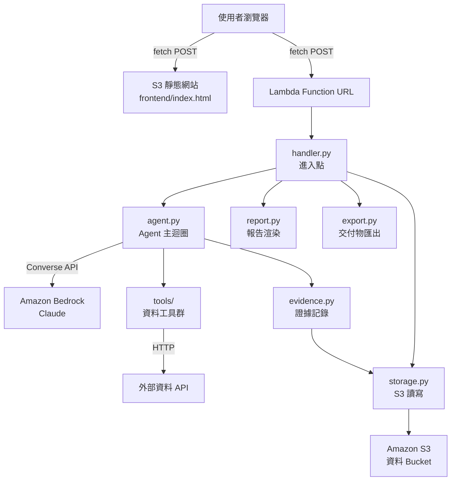
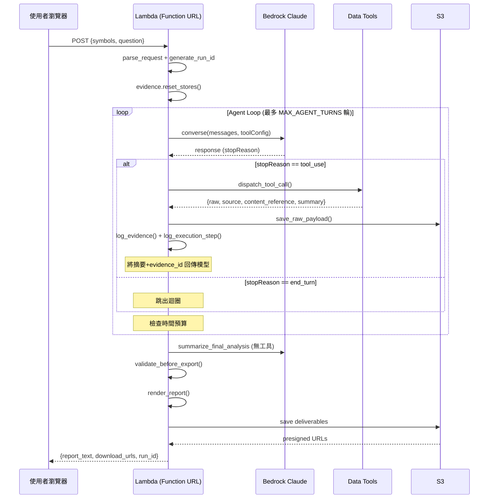
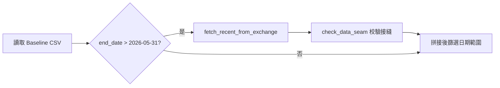

# 技術設計文件

## 概覽（Overview）

本系統為單一 AWS Lambda 函式驅動的加密市場分析 AI Agent。架構刻意精簡——一個 Lambda 承載整條分析流程，透過 Function URL 直接觸發（繞過 API Gateway 的 29 秒逾時），以 Amazon Bedrock Converse API 驅動 Claude 模型進行推理與工具呼叫，所有證據與交付物儲存於 S3。

設計核心原則：
- **單一 Lambda**：無 Step Functions、無 DynamoDB、無 API Gateway、無多 Agent 協作
- **工具永不拋錯**：所有 Data Tool 失敗時回傳 error dict，確保 Agent Loop 不中斷
- **證據自動記錄**：程式產生 source／fetched_at／content_reference，LLM 僅提供 related_claim
- **15 分鐘執行預算**：MAX_AGENT_TURNS + 時間檢查雙重終止條件

### 修訂需求的研究摘要與設計決策

本次設計先核對 Requirements 12、13、現有六個工具能力及 C2/C4/C5 模組契約。關鍵發現是：舊 `calculate_coverage()` 將五個預期類別當成固定分母，無法表達題目相關性、同一工具依結構化內容呈現的不同資料語意，以及失敗嘗試；同時，來源類別數量與分析維度是兩個不同概念。據此採取以下決策：

- 報告改為由證據與執行紀錄衍生的**多維度分析摘要**，只陳述本次實際分析與已知失敗，不計算覆蓋率或維度分數。
- 維度使用封閉且決定性的 13 維分類；來源類別仍只由 `export.py` 用於 `>= 3` 匯出驗證，不進入報告分母。
- C4 既有 `coverage` 參數名稱為相容性入口，不再代表百分比，而承載 Handler/Agent 由 execution log 衍生的報告 metadata；不增加跨模組呼叫或外部服務。
- C2 四欄位 Evidence Record、C5 HTTP 回應及整體單 Lambda 架構均保持不變。

## 架構（Architecture）



### 請求生命週期



## 元件與介面（Components and Interfaces）

### config.py — 環境變數與常數集中管理

所有外部設定的唯一讀取點。其他模組一律 `from config import X` 取用，不直接呼叫 `os.environ`。

| 變數 | 用途 | 預設值 |
|------|------|--------|
| `AWS_REGION` | AWS 區域 | `us-east-1` |
| `BEDROCK_MODEL_ID` | Bedrock 模型 ID | 必填 |
| `DATA_BUCKET` | S3 資料桶名稱 | 必填 |
| `MAX_AGENT_TURNS` | Agent 迴圈最大輪次 | `15` |
| `TIME_BUDGET_SECONDS` | 執行時間預算（秒） | `600` |
| `COINGECKO_API_KEY` | CoinGecko API 金鑰 | — |
| `ETHERSCAN_API_KEY` | Etherscan API 金鑰 | — |
| `HELIUS_API_KEY` | Helius API 金鑰 | — |
| `FRED_API_KEY` | FRED API 金鑰 | — |

常數：
- `SUPPORTED_SYMBOLS = ["BTC", "ETH", "SOL", "BNB", "XRP"]`
- `BASELINE_END_DATE = "2026-05-31"`

```python
def load_local_env() -> None
```
本機開發時從 `.env` 載入環境變數，部署後不使用。

---

### handler.py — Lambda 進入點

```python
def parse_request(event: dict) -> tuple[list[str], str]
    # 從 event body 取出 symbols（1-2 個）與 question
    # 驗證：symbols ⊂ SUPPORTED_SYMBOLS，question 非空
    # 失敗回傳 400 + 錯誤說明

def generate_run_id() -> str
    # 格式：run_YYYYMMDD_HHMMSS（UTC）

def lambda_handler(event: dict, context) -> dict
    # 回傳格式：
    # {
    #   "statusCode": 200,
    #   "headers": {"Access-Control-Allow-Origin": "*", ...},
    #   "body": json.dumps({
    #     "report_text": str,
    #     "evidence_download_url": str,
    #     "log_download_url": str,
    #     "run_id": str
    #   })
    # }

def main() -> None
    # 本機測試進入點，輸出至 outputs/ 資料夾
```

---

### agent.py — Agent 主迴圈與工具規格

#### 系統提示詞（SYSTEM_PROMPT）

```
你是加密市場分析助理。使用者會給你一個或兩個幣種和一個問題，
你要蒐集多方資料，產出一份有證據支撐的分析。你不做投資建議
（不說買進、賣出、目標價、建議持有），你只做資訊的整理與判斷。

分析規劃：
1. 先拆解題目要回答的子問題，從已實作能力中選擇至少 2 個能回答不同子問題、
   且彼此互補的相關分析維度。可用維度為：價格、技術指標、市場結構與流動性、
   衍生品、鏈上、情緒、預測市場、新聞與公告、總體經濟、DeFi、開發活躍度、
   機構資料、監管資料。不要為湊數選擇與題目無關的維度。
2. 依題目與已取得證據動態決定工具呼叫，不設固定工具數量、資料類別配額或
   強制呼叫順序。每次呼叫工具時 related_claim 必填，說明這筆資料要檢驗什麼。
3. 蒐集足以形成多維度判斷的證據，並保留「至少 3 個不同證據來源類別」作為
   匯出驗證政策；這個門檻不是報告的分母、覆蓋率或評分。
4. 對實際分析維度做交叉比較，明確說明一致訊號、背離訊號或證據不足；若來源
   矛盾，說明矛盾內容與取捨依據。
5. 對與題目相關但省略、無法取得或執行失敗的維度，說明原因及其對信心的影響；
   不臆測或列舉與題目無關且未嘗試的缺失維度。

寫作要求：
- 把分析拆成事實(fact) → 推論(inference) → 結論(conclusion)，所有被使用的事實
  都要附 evidence_id。
- 誠實說明已知限制、資料不足、矛盾訊號，以及可能推翻結論的條件。資料不足時
  就說「無法給出高信心判斷」，不要硬湊結論。
- 所有數字運算（技術指標、百分位、相關係數）都要透過 compute_quant 工具計算，
  不要自行心算。
```

#### 核心介面

```python
TOOL_DISPATCH: dict[str, Callable] = {
    "get_price_ohlcv": price.get_price_ohlcv,
    "search_news": news.search_news,
    "get_onchain": onchain.get_onchain,
    "compute_quant": quant.compute_quant,
    "get_sentiment": sentiment.get_sentiment,
    "get_macro": macro.get_macro,
}

def build_tool_config() -> dict
    # 組出 Bedrock toolConfig JSON
    # 每個 toolSpec 的 inputSchema 中 related_claim 為 required

def call_bedrock(messages: list[dict], tool_config: dict) -> dict
    # 呼叫 bedrock-runtime.converse()
    # 傳入 system=[{"text": SYSTEM_PROMPT}]

def dispatch_tool_call(run_id: str, tool_use_block: dict) -> dict
    # 1. 解析 tool_use_block 取 name + input
    # 2. TOOL_DISPATCH[name](**input)
    # 3. evidence.log_evidence() 記錄
    # 4. 回傳 toolResult（僅含 summary + evidence_id）

def run_agent_loop(run_id: str, question: str) -> list[dict]
    # 核心迴圈，最多 MAX_AGENT_TURNS 輪
    # 每輪開始前檢查 time.time() - start > TIME_BUDGET_SECONDS

def summarize_final_analysis(messages: list[dict]) -> str
    # 第二次 Bedrock 呼叫（不含 toolConfig）
    # 要求模型以「市場判斷／關鍵依據／信心說明」結構輸出
```

#### Bedrock Converse API 整合模式

Agent Loop 採「同步工具呼叫迴圈」模式：

1. 組裝 `messages` 陣列（user → assistant → user 交替）
2. 呼叫 `converse()`，檢查 `stopReason`：
   - `"tool_use"`: 取出 `output.message.content` 中所有 `toolUse` 區塊，逐一 `dispatch_tool_call()`，結果包成 `toolResult` 加回 `messages`
   - `"end_turn"`: 模型認為分析完成，跳出迴圈
3. 重複直到 end_turn 或達到終止條件

回傳給模型的 toolResult 格式：
```json
{
  "toolUseId": "<對應的 toolUseId>",
  "content": [{"json": {"summary": "...", "evidence_id": "..."}}]
}
```

設計決策：只回傳摘要不回傳原始資料，避免 context window 膨脹（原始資料已封存至 S3 供抽查）。

---

### evidence.py — 四欄位證據記錄

```python
evidence_list: list[dict] = []   # 執行期間累積
execution_log: list[dict] = []   # 執行期間累積

def reset_stores() -> None
    # 清空 evidence_list 與 execution_log（Lambda 容器可能重複使用）

def log_evidence(run_id: str, tool_name: str, related_claim: str, fetch_result: dict) -> str
    # 驗證 related_claim 非空且長度足夠
    # 自動產生：evidence_id（UUID）、source、fetched_at（ISO 8601 UTC）、content_reference
    # 呼叫 storage.save_raw_payload() 封存原始資料
    # 回傳 evidence_id

def log_execution_step(tool_name: str, status: str, elapsed_ms: int,
                       evidence_id: str | None = None, note: str | None = None) -> None
    # 記錄一筆 {timestamp, tool_name, status, elapsed_ms, evidence_id, note}
    # 成功與失敗都記錄
```

#### Evidence Record 結構

```json
{
  "evidence_id": "ev_a1b2c3",
  "source": "https://api.binance.com/api/v3/klines?symbol=SOLUSDT&interval=1d",
  "fetched_at": "2026-07-30T14:15:30Z",
  "content_reference": {"pair": "SOLUSDT", "range": "2026-06-01~2026-07-30", "rows": 60},
  "related_claim": "需要最近兩個月的日線資料來計算波動率指標"
}
```

---

### report.py — 報告渲染

`report.py` 是純渲染與確定性彙整層，**不得呼叫任何外部 API**。它只消費 `analysis_text`、`evidence_list`，以及 Agent/Handler 依既有 execution log 與分析結果整理出的 report metadata。C4 介面不增加參數；既有 `coverage` 參數名稱保留作為相容入口，但其值不再是百分比。

```python
ANALYSIS_DIMENSIONS = (
    "price", "technical_indicators", "market_structure_liquidity",
    "derivatives", "onchain", "sentiment", "prediction_markets",
    "news_announcements", "macro", "defi", "development_activity",
    "institutional_data", "regulation",
)

def classify_dimension(capability_id: str | None, source: str,
                       content_reference: dict) -> str
    # 依下表與固定優先序回傳唯一 primary dimension
    # 不使用 analysis_text 的自由文字猜測分類

def build_analysis_summary(evidence_list: list[dict], coverage: dict | None) -> dict
    # coverage 是 C4 的既有參數名稱；內容為 execution-log-derived/report metadata
    # 回傳實際分析維度、證據筆數、獨立來源數、逐維度明細、已知失敗維度

def build_evidence_table(evidence_list: list[dict]) -> str
    # 依 C2 四欄位契約輸出完整 Markdown 證據表

def render_report(analysis_text: str, evidence_list: list[dict],
                  missing_sources: list[str] | None, coverage: dict | None) -> str
    # 使用模板確保三個章節一定存在：
    #   1. 市場判斷
    #   2. 關鍵依據（每條附 evidence_id）
    #   3. 信心說明（限制、資料不足、矛盾、推翻條件、相關省略/失敗維度）
    # 附錄輸出 build_analysis_summary() 與完整證據表
```

原本的 `calculate_coverage(evidence_list) -> (percentage, obtained, missing)` 移除，不提供相容的固定五類計算。呼叫端改在既有 C4 `coverage` 位置傳入下列 metadata；這不改變 Evidence Record、HTTP 回應或模組依賴：

```json
{
  "analyzed_evidence_ids": ["ev_a1b2c3"],
  "evidence_capabilities": {"ev_a1b2c3": "technical.compute_quant"},
  "attempted_capabilities": [
    {"capability_id": "derivatives.funding", "status": "error", "reason": "timeout"}
  ],
  "relevant_omissions": [
    {"dimension": "regulation", "reason": "與題目相關但本次無可用來源", "confidence_impact": "中"}
  ]
}
```

`analyzed_evidence_ids` 由 Agent 最終分析實際引用的 evidence_id 產生；若缺少此欄位，渲染器只從 `analysis_text` 中可解析的 evidence_id 保守推導，不把僅蒐集但未使用的證據宣稱為「已分析」。`attempted_capabilities` 由既有 execution log 的工具名稱、狀態與 note，加上 dispatch 時已知的 capability metadata 整理；無法確定維度時不臆測，只在「已知失敗」明細保留原始工具名稱。

#### 決定性維度分類

每筆已採用證據只能有一個 primary dimension，避免重複計數。同一組 `capability_id + source + content_reference` 必定得到相同結果。分類依序採用：(1) 程式產生且屬於允許清單的 capability_id；(2) 結構化 `content_reference` 的 metric/data_type/provider；(3) 正規化 source provider；(4) 工具預設維度。若多條規則同時命中，固定優先序為：監管資料 → 機構資料 → 開發活躍度 → DeFi → 預測市場 → 衍生品 → 市場結構與流動性 → 鏈上 → 情緒 → 總體經濟 → 技術指標 → 價格 → 新聞與公告。

| 分析維度 | 決定性 capability／結構化識別規則 | 現有工具預設或例子 |
|---------|----------------------------------|-------------------|
| 價格 (`price`) | `price.ohlcv`、現貨價格／OHLCV／報酬資料；不含 order book 或衍生品欄位 | `get_price_ohlcv` 預設 |
| 技術指標 (`technical_indicators`) | `technical.*`；ATR、布林帶寬、ADX、成交量 Z-score、已實現波動率、相關係數、百分位 | `compute_quant` 預設 |
| 市場結構與流動性 (`market_structure_liquidity`) | `market_structure.*`；order book、bid-ask spread、depth、slippage、volume profile、現貨流動性 | 對應結構化 metric 命中，不以一般 OHLCV 成交量誤判 |
| 衍生品 (`derivatives`) | `derivatives.*`；funding、open interest、basis、liquidation、futures/options 指標 | 對應 provider 或 data_type 命中 |
| 鏈上 (`onchain`) | `onchain.*`；區塊、交易、地址、手續費、鏈上流量；排除已命中 DeFi 的協議指標 | `get_onchain` 預設 |
| 情緒 (`sentiment`) | `sentiment.*`；Fear & Greed、結構化社群情緒指標 | `get_sentiment` 預設 |
| 預測市場 (`prediction_markets`) | `prediction_market.*`；市場機率、合約機率、成交機率 | 已知 prediction-market provider/data_type |
| 新聞與公告 (`news_announcements`) | `news.*`；一般媒體、官方公告、RSS 新聞；僅在未命中更專門維度時使用 | `search_news` 預設 |
| 總體經濟 (`macro`) | `macro.*`；利率、通膨、就業、美元、流動性及經濟日程 | `get_macro` 預設 |
| DeFi (`defi`) | `defi.*`；TVL、協議存借款、DEX 流動性／交易、收益率、協議事件 | DeFi provider 或 protocol metric 命中 |
| 開發活躍度 (`development_activity`) | `development.*`；commit、contributor、release、issue、repository activity | GitHub release/開發資料，即使由 `search_news` 取得仍歸此維度 |
| 機構資料 (`institutional_data`) | `institutional.*`；ETF flow/holding、基金／託管／機構持倉與研究資料 | 已知機構 provider/data_type 命中 |
| 監管資料 (`regulation`) | `regulation.*`；監管機關規則、執法、申報、法院或立法資料 | 官方 regulator provider/data_type 命中 |

`build_analysis_summary()` 的計數規則：

- **證據筆數**：`evidence_list` 中合法且 evidence_id 不重複的實際筆數，不是類別配額。
- **獨立來源數**：URL 以小寫 hostname（移除 `www.`）正規化；非 URL 以程式維護的 canonical provider 名稱正規化後去重。同一 provider 的不同 endpoint 只算一個來源。
- **實際分析維度**：只取 `analyzed_evidence_ids` 對應的維度；逐維度列出 evidence_id、canonical source 與 content_reference 摘要。
- **失敗嘗試維度**：只列 execution-log-derived metadata 中可確定為 error、unavailable 或 timeout 的能力，保留狀態與原因；未知時不虛構。
- **相關缺失維度**：只呈現 Agent 標記為題目相關的省略，或實際嘗試失敗的維度；不得列出無關且未嘗試的維度。
- **禁止輸出**：不得產生 `x/5`、固定五類分母、類別覆蓋百分比、`x/3` 匯出門檻達成率或任何維度 score。

---

### export.py — 交付物匯出

```python
def export_evidence_list(evidence_list: list[dict], as_csv: bool = False) -> str
    # JSON 或 CSV 格式字串

def export_execution_log(execution_log: list[dict]) -> str
    # JSONL 格式（每行一筆 JSON）

def validate_before_export(evidence_list: list[dict], analysis_text: str) -> tuple[bool, list[str]]
    # 檢查：
    #   1. 每筆證據四欄位齊備
    #   2. 證據來源類別數 >= 3（僅為 export pass/fail 條件）
    #   3. 付費來源非唯一依據
    #   4. 無投資建議語句（買進/賣出/目標價/建議持有）
    # 不回傳供報告使用的分母、覆蓋率或分數
    # 回傳 (全數通過, 未通過項目清單)
```

---

### storage.py — S3 讀寫

```python
def read_baseline_csv(symbol: str) -> pd.DataFrame
    # 路徑：baseline/{symbol}USDT_daily_ohlcv.csv

def save_raw_payload(run_id: str, evidence_id: str, raw_data: dict) -> str
    # 路徑：runs/{run_id}/raw/{evidence_id}.json

def save_output_file(run_id: str, filename: str, content: str) -> str
    # 路徑：runs/{run_id}/{filename}

def generate_download_link(key: str, expires_in: int = 3600) -> str
    # S3 presigned URL，預設 1 小時有效
```

---

### tools/ — 資料工具群

所有工具遵循統一的介面合約（定義於 `tools/__init__.py`）：

#### 成功回傳格式

```python
{
    "raw": dict,               # 原始 API 回應（封存至 S3 供抽查）
    "source": str,             # 實際呼叫的 API 網址或來源名稱
    "content_reference": dict, # 引用片段／查詢參數／指標數值／資料區間
    "summary": str             # 給模型看的精簡摘要
}
```

#### 失敗回傳格式

```python
{
    "error": str,              # 錯誤說明
    "source": str,             # 原本要呼叫的 API
    "content_reference": {}    # 空
}
```

#### 工具清單

| 工具 | 檔案 | 外部來源 | 金鑰需求 |
|------|------|----------|----------|
| `get_price_ohlcv` | `tools/price.py` | Baseline CSV + Binance + CoinGecko | CoinGecko |
| `search_news` | `tools/news.py` | Google News RSS + 媒體 RSS + 官方 RSS/GitHub | 免鑰 |
| `get_onchain` | `tools/onchain.py` | mempool/Etherscan/Blockscout/Helius/XRPL | Etherscan, Helius |
| `compute_quant` | `tools/quant.py` | 無（本地 pandas 計算） | — |
| `get_sentiment` | `tools/sentiment.py` | alternative.me Fear & Greed | — |
| `get_macro` | `tools/macro.py` | FRED | FRED |

#### price.py 特殊邏輯：基準資料拼接



`check_data_seam()` 比對重疊日期的收盤價差異百分比，結果記入 execution_log 供抽查。

#### onchain.py 幣種分派

```python
match symbol:
    case "BTC": fetch_btc_onchain()      # mempool.space（免金鑰）
    case "ETH": fetch_evm_onchain("ethereum")  # Etherscan V2
    case "BNB": fetch_evm_onchain("bsc")       # Blockscout（免金鑰）
    case "SOL": fetch_sol_onchain()      # Helius
    case "XRP": fetch_xrp_onchain()      # XRPL 公開節點（免金鑰）
```

#### quant.py 支援的技術指標

| 指標 | 函式 | 用途 |
|------|------|------|
| ATR% | `calc_atr_pct(df, window)` | 波動率衡量 |
| 布林帶寬 | `calc_bollinger_bandwidth(df, window)` | 波動壓縮偵測 |
| ADX | `calc_adx(df, window)` | 趨勢強度 |
| 成交量 Z-score | 內嵌計算 | 成交量異常偵測 |
| 已實現波動率 | 內嵌計算 | 歷史波動率 |
| 相關係數 | `calc_correlation(df_a, df_b, window)` | 比較分析用 |
| 百分位排名 | `calc_percentile_rank(series, value, lookback)` | 所有指標共用 |

所有指標計算結果同時附帶歷史百分位排名（0-100），提供相對歷史位置的語境。

---

### frontend/index.html — 前端介面

單頁 HTML，部署於 S3 靜態網站。

- **輸入**：幣種選擇按鈕（最多選 2 個）、文字輸入區（分析題目）
- **等待**：spinner + 經過時間計時器 + 輪播提示文字
- **輸出**：marked.js 渲染 Markdown 報告 + 證據清單/執行紀錄下載連結
- **通訊**：直接 `fetch(LAMBDA_FUNCTION_URL)` POST，等待 5-10 分鐘回應（這就是為什麼不用 API Gateway）

---

## 資料模型（Data Models）

### 請求格式（Frontend → Lambda）

```json
{
  "symbols": ["SOL"],           // 1-2 個，從 SUPPORTED_SYMBOLS 選取
  "question": "市場上有聲音認為..."  // 非空字串
}
```

### 回應格式（Lambda → Frontend）

```json
{
  "report_text": "# 市場判斷\n...",
  "evidence_download_url": "https://s3...presigned...",
  "log_download_url": "https://s3...presigned...",
  "run_id": "run_20260730_141530"
}
```

### 錯誤回應格式

```json
{
  "error": "不支援的幣種代號: DOGE。支援的幣種為 BTC, ETH, SOL, BNB, XRP"
}
```

### S3 路徑慣例

```
s3://{DATA_BUCKET}/
├── baseline/
│   ├── BTCUSDT_daily_ohlcv.csv
│   ├── ETHUSDT_daily_ohlcv.csv
│   ├── SOLUSDT_daily_ohlcv.csv
│   ├── BNBUSDT_daily_ohlcv.csv
│   └── XRPUSDT_daily_ohlcv.csv
└── runs/
    └── {run_id}/
        ├── report.md
        ├── evidence_list.json
        ├── execution_log.jsonl
        └── raw/
            ├── {evidence_id_1}.json
            ├── {evidence_id_2}.json
            └── ...
```

### Bedrock Converse API 訊息格式

```python
# 初始訊息
messages = [
    {"role": "user", "content": [{"text": f"幣種：{symbol}\n題目：{question}"}]}
]

# 模型回應（含工具呼叫）
# response["output"]["message"]["content"] 可能包含：
# - {"text": "..."} 文字區塊
# - {"toolUse": {"toolUseId": "...", "name": "get_price_ohlcv", "input": {...}}}

# 工具結果回傳
messages.append({
    "role": "user",
    "content": [{
        "toolResult": {
            "toolUseId": "...",
            "content": [{"json": {"summary": "...", "evidence_id": "..."}}]
        }
    }]
})
```

### Execution Log 單筆格式（JSONL）

```json
{"timestamp": "2026-07-30T14:15:32Z", "tool_name": "get_price_ohlcv", "status": "success", "elapsed_ms": 1230, "evidence_id": "ev_a1b2c3", "note": null}
{"timestamp": "2026-07-30T14:15:35Z", "tool_name": "get_onchain", "status": "error", "elapsed_ms": 5012, "evidence_id": null, "note": "Helius API rate limit exceeded"}
```

### Report Metadata（C4 `coverage` 相容參數）

```json
{
  "analyzed_evidence_ids": ["ev_a1b2c3", "ev_d4e5f6"],
  "evidence_capabilities": {
    "ev_a1b2c3": "price.ohlcv",
    "ev_d4e5f6": "technical.compute_quant"
  },
  "attempted_capabilities": [
    {
      "capability_id": "derivatives.funding",
      "tool_name": "search_news",
      "status": "timeout",
      "reason": "upstream timeout"
    }
  ],
  "relevant_omissions": [
    {
      "dimension": "institutional_data",
      "reason": "本次無可用來源",
      "confidence_impact": "無法交叉驗證機構資金流"
    }
  ]
}
```

此 metadata 是單次執行中的衍生資料，不加入 Evidence Record，也不加入 C5 HTTP 回應。`capability_id` 只能使用維度分類表定義的程式常數；自由文字 reason/note 只供顯示，不能覆寫分類結果。`report.py` 可在欄位缺失時保守降級，但不得自行呼叫 API 補資料。

## 正確性屬性（Correctness Properties）

*屬性（Property）是在系統所有有效執行中都應成立的特徵或行為——本質上是對系統應做什麼的形式化陳述。屬性是人類可讀的規格與機器可驗證的正確性保證之間的橋梁。*

### 屬性反思（Property Reflection）

分析前述 prework 結果，以下進行合併與去重：

- 需求 1.2 與 1.3 可合併：兩者都測試「有效輸入應被接受」，差別只在 1 vs 2 個幣種
- 需求 2.1/2.2/2.3/2.4 可合併：都是「Agent Loop 必定終止」的不同面向
- 需求 4.1/4.2 可合併：都是「證據記錄包含正確欄位」
- 需求 5.1/5.2 可合併：「無論成功或失敗都產生執行紀錄」
- 需求 6.6/7.5/8.7/9.3/10.4/20.2/20.3 可合併：「所有工具永不拋錯」
- 需求 12.5/12.6/12.7 與 13.6/13.9 的報告資料轉換要求合併為「多維度附錄忠實且無固定分母」，避免重複檢查同一摘要
- 需求 13.1/13.7 合併為「投資建議交付前必拒絕」；驗證呼叫時機另以整合測試覆蓋
- 需求 13.8/13.9 的 export 邏輯合併為「三來源類別門檻僅約束匯出」
- 需求 12.2/12.3/12.4/12.8/12.9 與 13.2/13.3/13.4/13.5 主要涉及模型語意或特定情境，以 example/edge/integration 測試覆蓋，不建立無法普遍量化的屬性

最終精簡為以下獨立屬性：

---

### Property 1: 有效請求必定被接受

*For any* 由 1-2 個 SUPPORTED_SYMBOLS 元素與非空字串組成的請求，`parse_request` 必定成功回傳 symbols 與 question，不拋出例外。

**Validates: Requirements 1.2, 1.3**

---

### Property 2: 無效幣種必定被拒絕

*For any* 不在 SUPPORTED_SYMBOLS 中的字串作為幣種代號，`parse_request` 必定回傳包含錯誤說明的回應。

**Validates: Requirements 1.4**

---

### Property 3: Agent Loop 必定終止

*For any* Bedrock 回應序列（無論全部都是 tool_use），Agent Loop 必定在 MAX_AGENT_TURNS 輪內或 TIME_BUDGET_SECONDS 秒內結束，不會無限迴圈。

**Validates: Requirements 2.1, 2.2, 2.3, 2.4**

---

### Property 4: 容器重複使用不汙染

*For any* 初始狀態的 evidence_list 與 execution_log（包含前一次執行的殘留資料），呼叫 `reset_stores()` 後兩者必定為空列表。

**Validates: Requirements 2.6**

---

### Property 5: 工具分派正確性

*For any* Bedrock 回傳的 tool_use 區塊，若其 `name` 存在於 TOOL_DISPATCH 中，`dispatch_tool_call` 必定呼叫對應的工具函式且不呼叫其他函式。

**Validates: Requirements 3.2**

---

### Property 6: Context 膨脹防護

*For any* Data Tool 回傳的結果（含任意大小的 raw 欄位），回傳給模型的 toolResult 必定不包含 raw 原始資料，僅包含 summary 與 evidence_id。

**Validates: Requirements 3.6**

---

### Property 7: 證據記錄欄位完整性

*For any* 成功的工具執行結果，`log_evidence()` 產生的 Evidence Record 必定包含且僅包含 evidence_id、source、fetched_at、content_reference、related_claim 五個欄位，且 source 與 fetched_at 為自動產生（非由 LLM 提供）。

**Validates: Requirements 4.1, 4.2**

---

### Property 8: 空 related_claim 被拒絕

*For any* 空字串或純空白字元組成的 related_claim，`log_evidence()` 必定拒絕記錄且回傳錯誤，evidence_list 長度不增加。

**Validates: Requirements 4.4**

---

### Property 9: Evidence ID 唯一性

*For any* 同一次執行中產生的多筆 Evidence Record，所有 evidence_id 必定互不相同。

**Validates: Requirements 4.5**

---

### Property 10: 執行紀錄完整性

*For any* Data Tool 執行（無論成功或失敗），`log_execution_step()` 必定在 execution_log 中新增一筆記錄，包含 timestamp、tool_name、status、elapsed_ms 欄位。

**Validates: Requirements 5.1, 5.2**

---

### Property 11: JSONL 格式正確性

*For any* execution_log 內容，`export_execution_log()` 的輸出每一行必定是合法的 JSON 物件，且可被 `json.loads()` 成功解析。

**Validates: Requirements 5.3**

---

### Property 12: 工具永不拋錯

*For any* 輸入（包括觸發外部 API 失敗的情況），所有 Data Tool 函式必定回傳 dict 而非拋出未處理的例外。失敗時回傳的 dict 必定包含 `error` 欄位。

**Validates: Requirements 6.6, 7.5, 8.7, 9.3, 10.4, 20.2, 20.3**

---

### Property 13: 工具成功回傳格式統一

*For any* 成功的 Data Tool 執行，回傳的 dict 必定包含 raw、source、content_reference、summary 四個欄位。

**Validates: Requirements 20.1**

---

### Property 14: 技術指標含百分位

*For any* 有效的 OHLCV DataFrame 與指標計算請求，`compute_quant` 的回傳結果中每個指標必定同時包含原始數值與百分位排名（0 至 100 之間的數值）。

**Validates: Requirements 11.3**

---

### Property 15: 相關係數值域

*For any* 兩組有效的 OHLCV DataFrame，`calc_correlation()` 的結果必定在 [-1, 1] 區間內。

**Validates: Requirements 11.4**

---

### Property 16: 報告三章節保證

*For any* 分析文字、證據清單與合法 report metadata，`render_report()` 產出的 Markdown 必定包含「市場判斷」、「關鍵依據」、「信心說明」三個章節標題。

**Validates: Requirements 12.1**

---

### Property 17: 維度分類決定性與完備性

*For all* 已實作 capability_id 及其合法 source/content_reference，同一輸入重複呼叫 `classify_dimension()` 必定回傳相同結果，且結果必定是 13 個 `ANALYSIS_DIMENSIONS` 之一；若多個識別規則命中，必定依固定優先序選出唯一 primary dimension。

**Validates: Requirements 12.5**

---

### Property 18: 多維度附錄忠實且無固定分母

*For any* 合法 evidence_list 與 execution-log-derived report metadata，`build_analysis_summary()` 及 `render_report()` 必定：(a) 以不重複 evidence_id 計算實際證據筆數；(b) 以 canonical provider 計算獨立來源數；(c) 只列實際採用證據對應的分析維度與逐維度 evidence/source 明細；(d) 完整列出可確定的失敗嘗試及相關省略；且 (e) 不產生固定 `x/5`、固定五類分母、類別覆蓋百分比、`x/3` 門檻達成率或維度分數。

**Validates: Requirements 12.5, 12.6, 12.7, 13.6, 13.9**

---

### Property 19: 投資建議交付前必拒絕

*For any* 包含「買進」、「賣出」、「目標價」、「建議持有」等禁止投資建議語句的分析文字，`validate_before_export()` 必定將其標記為未通過。

**Validates: Requirements 13.1, 13.7**

---

### Property 20: 三來源類別門檻僅約束匯出

*For any* 證據清單，`validate_before_export()` 必定正確計算不重複的證據來源類別，且此項驗證若且唯若類別數 `>= 3` 時通過；相同輸入交給報告摘要時，該門檻不得被用作分母、覆蓋率或評分。

**Validates: Requirements 13.8, 13.9**

## 錯誤處理（Error Handling）

### 設計原則：工具永不拋錯

所有 Data Tool 在任何情況下（網路逾時、API 限流、回應解析失敗、金鑰無效）都不會拋出未處理的例外。這是整個系統最重要的韌性設計——Agent Loop 不會因為單一外部 API 的問題而中斷。

```python
# 每個工具函式的結構
def get_xxx(related_claim, ...):
    try:
        response = requests.get(url, timeout=30)
        response.raise_for_status()
        data = response.json()
        return {
            "raw": data,
            "source": url,
            "content_reference": {...},
            "summary": "..."
        }
    except Exception as e:
        return {
            "error": f"[{tool_name}] {type(e).__name__}: {str(e)}",
            "source": url,
            "content_reference": {}
        }
```

### 錯誤傳播策略

| 層級 | 行為 |
|------|------|
| Data Tool | 捕獲所有例外，回傳 error dict |
| dispatch_tool_call | 檢查回傳值是否含 error 欄位，若是則 log_execution_step 記錄失敗狀態 |
| Agent Loop | 無論工具成功或失敗，都把結果（摘要或錯誤訊息）回傳給模型，讓模型自行決定是否重試或調整策略 |
| lambda_handler | 外層 try/except 捕獲未預期的錯誤，回傳 500 + 錯誤說明（含 CORS 標頭） |

### 時間預算超限

Agent Loop 在每輪開始前檢查已耗用時間。超出 TIME_BUDGET_SECONDS 時：
1. 標記當前狀態為「時間預算耗盡」
2. 直接進入 summarize_final_analysis 階段
3. 將尚未完成且與題目相關的維度寫入 report metadata；報告信心說明只標註這些相關省略與已知失敗及其信心影響

### Bedrock API 錯誤

| 錯誤類型 | 處理方式 |
|----------|----------|
| ThrottlingException | 等待 2 秒後重試一次，仍失敗則跳出迴圈進入報告階段 |
| ModelTimeoutException | 跳出迴圈進入報告階段 |
| ValidationException | 通常是 token 超限，跳出迴圈 |
| 其他 | 記錄錯誤，跳出迴圈 |

### 前端通訊錯誤處理

- Lambda 的所有回應（含錯誤）都帶 CORS 標頭
- HTTP 狀態碼語義：200（成功）、400（請求無效）、500（內部錯誤）
- 前端 fetch 可能因網路斷線或 Lambda cold start 逾時失敗 → 前端顯示明確錯誤訊息與重試建議

## 測試策略（Testing Strategy）

### 雙軌測試方法

本專案採用**屬性測試（Property-Based Testing）+ 單元測試（Example-Based）+ 整合測試**三層策略：

| 層級 | 範圍 | 工具 | 迭代次數 |
|------|------|------|----------|
| 屬性測試 | 純函式邏輯、輸入驗證、格式保證 | Hypothesis | >= 100 次 |
| 單元測試 | 特定情境、邊界條件、Mock 外部服務 | pytest | — |
| 整合測試 | 五幣種 × 三題型組合、S3 互動 | pytest + moto | — |

### PBT 適用性評估

本專案的以下模組適合屬性測試：
- **handler.parse_request**：輸入驗證是經典 PBT 場景（隨機有效/無效輸入）
- **evidence.log_evidence**：欄位產生與狀態重設具有明確不變量
- **export.validate_before_export**：禁止語句與 `>= 3` 來源類別規則是確定性的布林判斷
- **tools/quant.py**：所有計算都是純 pandas 運算，有明確的數學性質
- **report.classify_dimension**：封閉分類、唯一結果與優先序是確定性純邏輯
- **report.build_analysis_summary**：去重計數、來源正規化、維度分組與失敗集合過濾是純資料轉換
- **report.render_report**：模板結構及禁止產生固定分母/分數具有輸出不變量

以下模組不適合 PBT，改用其他策略：
- **Bedrock 的題目相關性、維度互補性與跨維度推理**：屬語意行為，以代表性題型 + Mock 做 example/integration 測試
- **S3 讀寫**：用 moto 模擬，做整合測試
- **外部 API 呼叫**：用 Mock 驗證錯誤處理路徑
- **Markdown 可讀性與事實→推論→結論的語意品質**：使用結構斷言與人工評估案例

### 屬性測試配置

- 使用 **Hypothesis** 作為 PBT 框架
- 每個屬性以**單一 property-based test** 實作，每個測試最少 100 次迭代
- 每個測試以註解標記對應的設計屬性，格式固定為 `Feature: crypto-market-agent, Property {number}: {property_text}`：

```python
# Feature: crypto-market-agent, Property 1: 有效請求必定被接受
@given(
    symbols=st.lists(st.sampled_from(SUPPORTED_SYMBOLS), min_size=1, max_size=2),
    question=st.text(min_size=1)
)
def test_valid_request_accepted(symbols, question):
    result = parse_request({"body": json.dumps({"symbols": symbols, "question": question})})
    assert result is not None
    assert len(result[0]) == len(symbols)
```

Properties 17、18 的生成器必須涵蓋所有 13 維 capability_id、同 provider 不同 URL、重複 evidence_id、未被分析引用的證據、成功/失敗混合嘗試、相關與無關省略，以及可能同時命中多條分類規則的輸入。Property 20 必須將來源**類別**與報告的獨立 source/provider 計數分開生成，避免誤把 export policy 寫回報告。

### 單元測試重點

- CORS 標頭與 C5 成功/失敗 HTTP body 欄位維持不變（Smoke）
- C2 Evidence Record 仍只有 source、fetched_at、content_reference、related_claim 加 evidence_id（Smoke）
- SYSTEM_PROMPT 要求至少兩個題目相關且互補的維度、說明相關省略、交叉比較一致/背離/不足，且不含固定工具數、固定類別配額或強制呼叫順序（Smoke）
- 一致訊號、背離訊號、來源矛盾及證據不足各一組代表案例；驗證事實→推論→結論與 evidence_id 引用（Example/Edge）
- `report.py` 在網路 client 被設為失敗時仍可完成渲染，證明沒有外部 API 呼叫（Unit）
- 附錄包含實際維度、證據筆數、獨立來源數、逐維度明細及已知失敗；不包含 `5/5`、`4/5`、固定百分比或 dimension score（Example）
- 相關省略/失敗會進入信心說明並描述 confidence impact；無關且未嘗試的維度不出現（Edge）
- Bedrock end_turn 正確退出迴圈、比較分析題型的 2 幣種輸入處理、Lambda 15 分鐘逾時配置（Example/Smoke）

### 整合測試重點

- 五幣種 × 三題型 = 15 組合的端到端流程（使用 Mock Bedrock），每案至少選兩個互補維度並覆蓋一致、背離或不足狀態
- Handler/Agent 從 execution log 整理 report metadata，透過既有 C4 `coverage` 位置交給 report；不改 Evidence Record 與 C5 HTTP 回應
- `validate_before_export()` 在來源類別少於 3 時拒絕、達 3 時通過；相同執行的 report 不把 3 當分母或分數
- 匯出驗證在儲存 report 前執行投資建議語句檢查
- S3 baseline CSV 讀取、Presigned URL 產生及原始 API 回應封存路徑正確性（使用 moto）

### 本機測試

`tests/test_local_run.py` 已存在，提供：
- 寫死測試輸入的完整分析流程
- 輸出至 `outputs/` 資料夾
- 涵蓋五幣種與三題型的組合驗證

### 部署配置

| 項目 | 值 |
|------|-----|
| Runtime | Python 3.12 |
| 記憶體 | 512 MB（pandas 計算需要） |
| 逾時 | 900 秒（15 分鐘） |
| 套件提供 | Lambda Layer（pandas + numpy） |
| Function URL | 啟用，CORS 設定 `*` |
| 環境變數 | 見 config.py 列表 |

### Lambda Layer 部署方式

pandas 與 numpy 不在 Lambda 內建環境中，需建立 Lambda Layer：

```bash
# 建立 Layer 套件
mkdir -p python
pip install pandas numpy -t python/
zip -r pandas-layer.zip python/

# 上傳 Layer
aws lambda publish-layer-version \
  --layer-name pandas-numpy \
  --zip-file fileb://pandas-layer.zip \
  --compatible-runtimes python3.12
```

或使用容器映像方式部署（適合套件總大小超過 Layer 250MB 限制時）。

