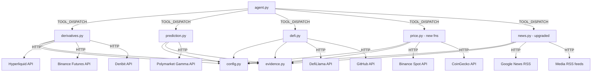

# Design: 資料工具增強（data-tools-enhancement）

## Overview

本設計擴充 `lambda/tools/` 目錄下的資料蒐集工具，新增三個模組檔案與修改兩個既有檔案，涵蓋衍生品資料（Tier 1）、預測市場（Tier 2）、市場結構深化（Tier 3）、DeFi/開發活躍度（Tier 4）、以及新聞來源升級（Tier 5）。

**設計目標：**
- 所有新工具嚴格遵循契約 C1 回傳格式
- 每個工具函式自行捕獲所有例外，絕不向外拋出
- 工具之間零耦合（不得互相 import）
- 單一來源失敗不影響整體分析流程（graceful degradation）
- HTTP 請求一律 30 秒 timeout

**新增/修改檔案：**
| 檔案 | 動作 | 包含工具 |
|------|------|----------|
| `lambda/tools/derivatives.py` | 新增 | `get_derivatives` (Hyperliquid / Binance Futures / Deribit) |
| `lambda/tools/prediction.py` | 新增 | `get_prediction_market` (Polymarket) |
| `lambda/tools/defi.py` | 新增 | `get_defi_data` (DefiLlama), `get_dev_activity` (GitHub) |
| `lambda/tools/price.py` | 修改 | 新增 `get_orderbook_depth`, `get_market_dominance` |
| `lambda/tools/news.py` | 修改 | 替換 CryptoPanic → Google News RSS + 媒體 RSS |
| `lambda/config.py` | 修改 | 新增環境變數 |
| `lambda/agent.py` | 修改 | 擴充 TOOL_DISPATCH + build_tool_config() |
| `lambda/tools/__init__.py` | 修改 | 匯出新模組 |

## Architecture



**架構決策：**
1. **單一入口函式模式**：`derivatives.py` 使用 `get_derivatives(symbol, source, metrics, related_claim)` 作為唯一公開函式，內部依 `source` 參數分派到 Hyperliquid / Binance Futures / Deribit 的 fetcher，與 `onchain.py` 的 `get_onchain` 依 symbol 分派的模式一致。
2. **無 async**：Lambda 單執行緒環境，所有 HTTP 呼叫為同步 `requests.get/post`。
3. **降級提示**：當 Hyperliquid 失敗時，error dict 中包含 `fallback_suggestion: "binance_futures"` 欄位，供 Agent 決定是否改用替代來源。

## Components and Interfaces

### 1. `lambda/tools/derivatives.py` — 衍生品資料工具

**公開函式：**

```python
def get_derivatives(symbol: str, source: str, metrics: list, related_claim: str) -> dict:
    """取得衍生品市場資料（資金費率、OI、清算、DVOL、多空比等）。

    Args:
        symbol: 幣種代碼（BTC, ETH, SOL, BNB, XRP）
        source: 資料來源，可選 "hyperliquid" | "binance_futures" | "deribit"
        metrics: 要取得的指標列表，依來源不同支援不同指標：
            - hyperliquid: ["funding_rate", "open_interest", "mark_price", "liquidations"]
            - binance_futures: ["funding_rate", "open_interest", "long_short_ratio", "taker_buy_sell_ratio"]
            - deribit: ["dvol", "options_oi", "put_call_ratio"]
        related_claim: Agent 說明取數目的

    Returns:
        Contract C1 dict or error dict
    """
```

**內部分派邏輯：**
```python
match source.lower():
    case "hyperliquid":
        return _fetch_hyperliquid(symbol, metrics)
    case "binance_futures":
        return _fetch_binance_futures(symbol, metrics)
    case "deribit":
        return _fetch_deribit(symbol, metrics)
    case _:
        return {"error": f"Unsupported derivatives source: {source}"}
```

**Hyperliquid API 細節：**
- Base URL: `https://api.hyperliquid.xyz/info` (POST)
- 免鑰、無 rate limit 硬限制（建議 ≤10 req/s）
- 取得資金費率 + OI + mark price：`{"type": "metaAndAssetCtxs"}`
  - 回傳所有幣種的 assetCtxs 陣列，每筆含 `funding`, `openInterest`, `markPx`
  - 需從陣列中依 symbol 過濾目標幣種
- 取得歷史資金費率：`{"type": "fundingHistory", "coin": "BTC", "startTime": <ms>}`
- 取得清算資料：`{"type": "userFills"}` — 但公開 API 不提供全市場清算聚合，改用 `clearinghouseState` 查詢全市場未平倉

**Binance Futures API 細節：**
- Base URL: `https://fapi.binance.com`
- 所有 endpoint 為 GET，免鑰
- 資金費率：`GET /fapi/v1/premiumIndex?symbol={symbol}USDT`
  - 回傳：`lastFundingRate`, `markPrice`, `indexPrice`, `nextFundingTime`
- 未平倉量：`GET /fapi/v1/openInterest?symbol={symbol}USDT`
  - 回傳：`openInterest` (合約數量), `symbol`, `time`
- 大戶多空比：`GET /futures/data/topLongShortPositionRatio?symbol={symbol}USDT&period=5m&limit=1`
  - 回傳：`longShortRatio`, `longAccount`, `shortAccount`, `timestamp`
- 吃單買賣比：`GET /futures/data/takerlongshortRatio?symbol={symbol}USDT&period=5m&limit=1`
  - 回傳：`buySellRatio`, `buyVol`, `sellVol`, `timestamp`

**Deribit API 細節：**
- Base URL: `https://www.deribit.com/api/v2`
- 免鑰（公開 endpoint），僅支援 BTC 與 ETH
- DVOL 隱含波動率：`GET /public/get_volatility_index_data?currency={currency}&start_timestamp={ms}&end_timestamp={ms}&resolution=3600`
  - 回傳 `result.data` 為 candle 陣列 `[timestamp, open, high, low, close]`
- 期權 OI（透過 ticker）：`GET /public/ticker?instrument_name={currency}-PERPETUAL`
  - 回傳含 `open_interest`, `funding_8h`, `mark_price`
- Put/Call OI 比率：需呼叫 `GET /public/get_book_summary_by_currency?currency={currency}&kind=option`
  - 遍歷所有 option instrument，分類 P/C 並加總 OI 計算比率

### 2. `lambda/tools/prediction.py` — 預測市場工具

**公開函式：**

```python
def get_prediction_market(keywords: str, related_claim: str) -> dict:
    """從 Polymarket 查詢加密相關事件市場的價格與成交量。

    Args:
        keywords: 搜尋關鍵字（如 "bitcoin", "ETH ETF", "crypto regulation"）
        related_claim: Agent 說明取數目的

    Returns:
        Contract C1 dict or error dict
    """
```

**Polymarket Gamma API 細節：**
- Base URL: `https://gamma-api.polymarket.com`
- 免鑰、免認證
- 搜尋市場：`GET /events?tag=crypto&active=true&closed=false&limit=10`
  - 或使用公開搜尋：`GET /public-search?query={keywords}&type=events`
- 取得單一事件：`GET /events/{event_id}`
- 市場資料欄位：`title`, `outcomePrices` (JSON string), `volume`, `liquidity`, `endDate`
- 7 日價格變化：需從 CLOB API 取得歷史價格
  - CLOB Base URL: `https://clob.polymarket.com`
  - `GET /prices-history?market={token_id}&interval=1d&fidelity=7`

**回傳 summary 格式範例：**
```
Polymarket 加密事件市場：
- "BTC $150K by Dec 2026": 機率 42%（7日 +5%），成交量 $2.1M
- "ETH ETF approval Q3": 機率 78%（7日 -2%），成交量 $890K
```

### 3. `lambda/tools/defi.py` — DeFi 與開發活躍度工具

**公開函式 A：**

```python
def get_defi_data(metrics: list, chain: str, related_claim: str) -> dict:
    """取得 DeFi TVL 與穩定幣供給資料。

    Args:
        metrics: 要取得的指標列表 ["tvl", "stablecoin_supply"]
        chain: 指定鏈名稱（如 "Ethereum", "Solana"）或 "all" 代表全市場
        related_claim: Agent 說明取數目的

    Returns:
        Contract C1 dict or error dict
    """
```

**DefiLlama API 細節：**
- Base URL: `https://api.llama.fi`
- 免鑰、免認證
- 全市場 TVL：`GET /v2/historicalChainTvl`
- 指定鏈 TVL：`GET /v2/historicalChainTvl/{chain}`（如 Ethereum, Solana, BSC）
- 目前各鏈 TVL：`GET /v2/chains`
- 穩定幣供給（另一 base URL）：`https://stablecoins.llama.fi`
  - 目前總供給：`GET /stablecoins?includePrices=true`
  - 歷史供給：`GET /stablecoincharts/all?stablecoin=1`（1=USDT, 2=USDC 等）

**公開函式 B：**

```python
def get_dev_activity(symbol: str, related_claim: str) -> dict:
    """取得指定幣種專案的 GitHub 開發活躍度。

    Args:
        symbol: 幣種代碼（BTC, ETH, SOL, BNB, XRP）
        related_claim: Agent 說明取數目的

    Returns:
        Contract C1 dict or error dict
    """
```

**GitHub API 細節：**
- Base URL: `https://api.github.com`
- 免鑰（unauthenticated 限制 60 次/小時，足夠本專案）
- Symbol → Repo 映射表：
  ```python
  _SYMBOL_TO_REPO = {
      "BTC": ("bitcoin", "bitcoin"),
      "ETH": ("ethereum", "go-ethereum"),
      "SOL": ("solana-labs", "solana"),
      "BNB": ("bnb-chain", "bsc"),
      "XRP": ("XRPLF", "rippled"),
  }
  ```
- 近 4 週 commit 頻率：`GET /repos/{owner}/{repo}/stats/commit_activity`
  - 回傳最近 52 週每週 commit 數，取最後 4 週加總
- 最新 release：`GET /repos/{owner}/{repo}/releases/latest`
  - 回傳 `tag_name`, `published_at`, `name`

### 4. `lambda/tools/price.py` 新增函式 — 盤口深度與市值佔比

**新增函式 A：**

```python
def get_orderbook_depth(symbol: str, related_claim: str) -> dict:
    """取得 Binance Spot 盤口深度快照，計算 ±2% 範圍內的累積掛單量。

    Args:
        symbol: 幣種代碼（BTC, ETH, SOL, BNB, XRP）
        related_claim: Agent 說明取數目的

    Returns:
        Contract C1 dict or error dict
    """
```

**Binance Spot Depth API：**
- Endpoint: `GET https://api.binance.com/api/v3/depth?symbol={symbol}USDT&limit=1000`
- 免鑰
- 回傳 `bids` 和 `asks` 各 1000 筆 `[price, qty]`
- 計算邏輯：
  1. best_bid = bids[0][0], best_ask = asks[0][0]
  2. bid_threshold = best_bid * 0.98, ask_threshold = best_ask * 1.02
  3. bid_depth_2pct = sum(qty for price, qty in bids if price >= bid_threshold)
  4. ask_depth_2pct = sum(qty for price, qty in asks if price <= ask_threshold)

**新增函式 B：**

```python
def get_market_dominance(related_claim: str) -> dict:
    """取得各主要幣種的市值佔比（dominance）。

    Args:
        related_claim: Agent 說明取數目的

    Returns:
        Contract C1 dict or error dict
    """
```

**CoinGecko Global API：**
- Endpoint: `GET https://api.coingecko.com/api/v3/global`
- 需 demo API key（`x-cg-demo-api-key` header）
- 回傳 `data.market_cap_percentage`：`{"btc": 54.2, "eth": 17.8, ...}`
- 回傳 `data.total_market_cap`：各法幣計價的總市值

### 5. `lambda/tools/news.py` 升級 — 替換 CryptoPanic 為免費 RSS

**修改策略：**
- 移除 `CRYPTOPANIC_API_KEY` 依賴
- `search_news()` 函式簽名不變，內部改為：
  1. Google News RSS 聚合（主要新聞來源）
  2. 媒體 RSS 白名單（CoinDesk、The Block、Cointelegraph）
  3. 保留既有官方部落格 RSS + GitHub releases 邏輯

**Google News RSS 細節：**
- URL 模板：`https://news.google.com/rss/search?q={query}+crypto&hl=en&gl=US&ceid=US:en`
- 免鑰、無 rate limit
- 回傳標準 RSS 2.0 XML（可複用既有 `_parse_rss_entries`）
- query 由 symbol 對應的搜尋詞決定：`{"BTC": "bitcoin", "ETH": "ethereum", ...}`

**媒體 RSS 白名單：**
```python
_MEDIA_RSS_FEEDS = [
    {"url": "https://www.coindesk.com/arc/outboundfeeds/rss/", "source_name": "CoinDesk", "channel": "media_rss"},
    {"url": "https://www.theblock.co/rss.xml", "source_name": "The Block", "channel": "media_rss"},
    {"url": "https://cointelegraph.com/rss", "source_name": "Cointelegraph", "channel": "media_rss"},
]
```

**新聞項目增加 `channel` 欄位：**
每則新聞標註 `channel` 值：`"google_news"` | `"media_rss"` | `"official_rss"` | `"github_release"`

**降級策略：**
每個 RSS feed 獨立 try/except，單一 feed 失敗時 skip 並繼續處理其他來源，回傳已成功取得的結果。

### 6. `lambda/config.py` 新增環境變數

```python
# ---- 新增的外部 API 金鑰（皆為選用，缺少時對應工具 graceful fail）----
CMC_API_KEY = os.environ.get("CMC_API_KEY")           # CoinMarketCap（未來交叉驗證用）
COINGLASS_API_KEY = os.environ.get("COINGLASS_API_KEY")  # Coinglass（選用，免費層很小）
REDDIT_CLIENT_ID = os.environ.get("REDDIT_CLIENT_ID")    # Reddit OAuth（選用）
REDDIT_CLIENT_SECRET = os.environ.get("REDDIT_CLIENT_SECRET")
SOSOVALUE_API_KEY = os.environ.get("SOSOVALUE_API_KEY")  # SoSoValue ETF 資料（選用）
DUNE_API_KEY = os.environ.get("DUNE_API_KEY")            # Dune Analytics（選用）
```

注意：本次實作的工具（Hyperliquid、Binance Futures、Deribit、Polymarket、DefiLlama、GitHub、Google News RSS、媒體 RSS）全部免鑰。新增的環境變數是為未來 Tier 擴充預留。`config.py` 的 `load_local_env()` 須同步更新 global 宣告。

### 7. `lambda/agent.py` 擴充

**TOOL_DISPATCH 新增：**
```python
from tools import derivatives, prediction, defi

TOOL_DISPATCH = {
    # ... 既有 6 個工具 ...
    "get_derivatives": derivatives.get_derivatives,
    "get_prediction_market": prediction.get_prediction_market,
    "get_defi_data": defi.get_defi_data,
    "get_dev_activity": defi.get_dev_activity,
    "get_orderbook_depth": price.get_orderbook_depth,
    "get_market_dominance": price.get_market_dominance,
}
```

**build_tool_config() 新增 toolSpec：**

```python
{
    "toolSpec": {
        "name": "get_derivatives",
        "description": "取得衍生品市場資料：資金費率、未平倉量(OI)、清算、隱含波動率(DVOL)、大戶多空比。"
                       "可用來源：hyperliquid（主力，免鑰）、binance_futures（備援+散戶指標）、deribit（僅BTC/ETH，期權波動率）。"
                       "訊號價值：資金費率極端=擁擠方向、OI急增+價格滯漲=槓桿堆積、DVOL vs 已實現波動率價差=市場買保險程度。",
        "inputSchema": {
            "json": {
                "type": "object",
                "properties": {
                    "symbol": {"type": "string", "description": "幣種代號（BTC/ETH/SOL/BNB/XRP）"},
                    "source": {"type": "string", "description": "資料來源：hyperliquid | binance_futures | deribit"},
                    "metrics": {
                        "type": "array", "items": {"type": "string"},
                        "description": "要取得的指標。hyperliquid: funding_rate/open_interest/mark_price/liquidations; "
                                       "binance_futures: funding_rate/open_interest/long_short_ratio/taker_buy_sell_ratio; "
                                       "deribit: dvol/options_oi/put_call_ratio"
                    },
                    "related_claim": {"type": "string", "description": "這筆資料要用來檢驗什麼判斷（必填）"}
                },
                "required": ["symbol", "source", "metrics", "related_claim"]
            }
        }
    }
},
{
    "toolSpec": {
        "name": "get_prediction_market",
        "description": "查詢 Polymarket 預測市場上加密相關事件的市場定價（機率）與成交量。"
                       "訊號價值：預測市場用真金白銀定價的共識機率，與現貨走勢比對可發現「價格未反映的預期」。",
        "inputSchema": {
            "json": {
                "type": "object",
                "properties": {
                    "keywords": {"type": "string", "description": "搜尋關鍵字（如 bitcoin, ETH ETF, crypto regulation）"},
                    "related_claim": {"type": "string", "description": "這筆資料要用來檢驗什麼判斷（必填）"}
                },
                "required": ["keywords", "related_claim"]
            }
        }
    }
},
{
    "toolSpec": {
        "name": "get_defi_data",
        "description": "取得 DeFi TVL 與穩定幣供給量資料（DefiLlama 免鑰）。"
                       "訊號價值：穩定幣增發=場外資金彈藥進場、TVL 與幣價背離=DeFi 使用量脫鉤價格。",
        "inputSchema": {
            "json": {
                "type": "object",
                "properties": {
                    "metrics": {
                        "type": "array", "items": {"type": "string"},
                        "description": "要取得的指標：tvl / stablecoin_supply"
                    },
                    "chain": {"type": "string", "description": "指定鏈（Ethereum/Solana/BSC）或 all 代表全市場"},
                    "related_claim": {"type": "string", "description": "這筆資料要用來檢驗什麼判斷（必填）"}
                },
                "required": ["metrics", "related_claim"]
            }
        }
    }
},
{
    "toolSpec": {
        "name": "get_dev_activity",
        "description": "取得幣種專案的 GitHub 開發活躍度（近4週 commit 數、最新 release）。"
                       "訊號價值：開發活躍度與價格背離=基本面健康但市場未反映，或反之。",
        "inputSchema": {
            "json": {
                "type": "object",
                "properties": {
                    "symbol": {"type": "string", "description": "幣種代號（BTC/ETH/SOL/BNB/XRP）"},
                    "related_claim": {"type": "string", "description": "這筆資料要用來檢驗什麼判斷（必填）"}
                },
                "required": ["symbol", "related_claim"]
            }
        }
    }
},
{
    "toolSpec": {
        "name": "get_orderbook_depth",
        "description": "取得 Binance Spot 盤口深度快照，計算目前價格 ±2% 範圍內的累積掛單量。"
                       "訊號價值：深度薄=大單容易造成滑價、買賣深度不對稱=潛在方向性壓力。",
        "inputSchema": {
            "json": {
                "type": "object",
                "properties": {
                    "symbol": {"type": "string", "description": "幣種代號（BTC/ETH/SOL/BNB/XRP）"},
                    "related_claim": {"type": "string", "description": "這筆資料要用來檢驗什麼判斷（必填）"}
                },
                "required": ["symbol", "related_claim"]
            }
        }
    }
},
{
    "toolSpec": {
        "name": "get_market_dominance",
        "description": "取得 BTC 及各幣種的市值佔比（dominance）。"
                       "訊號價值：BTC dominance 上升=資金從山寨回流比特幣（避險）、下降=資金輪動到山寨（risk-on）。",
        "inputSchema": {
            "json": {
                "type": "object",
                "properties": {
                    "related_claim": {"type": "string", "description": "這筆資料要用來檢驗什麼判斷（必填）"}
                },
                "required": ["related_claim"]
            }
        }
    }
}
```

## Data Models

### Contract C1 成功回傳結構（所有新工具共用）

```python
{
    "raw": dict | list,          # 原始 API 回應，封存到 S3
    "source": str,               # 實際呼叫的 API URL 或來源名稱
    "content_reference": {       # 可回溯資訊
        "endpoints_called": list[str],
        "query_params": dict,
        "metrics_retrieved": list[str],
        "fetched_at": str,       # UTC ISO 8601
        "elapsed_ms": int,       # 實際請求耗時
        # ... 依工具而異的具體數值欄位
    },
    "summary": str,              # ≤500 tokens 的精簡摘要
}
```

### Contract C1 失敗回傳結構

```python
{
    "error": str,                # 可讀的錯誤說明，格式 "[function_name] ErrorType: message"
    "source": str,               # 嘗試呼叫的來源
    "content_reference": {},     # 空 dict
    "fallback_suggestion": str,  # （選用）建議的替代來源，如 "binance_futures"
}
```

### Derivatives content_reference 範例

```python
{
    "endpoints_called": ["https://api.hyperliquid.xyz/info"],
    "query_params": {"type": "metaAndAssetCtxs"},
    "symbol": "BTC",
    "source_name": "Hyperliquid",
    "funding_rate": 0.0008,
    "open_interest_usd": 1250000000,
    "mark_price": 105000.5,
    "fetched_at": "2026-08-01T06:00:00Z",
    "elapsed_ms": 450,
}
```

### Prediction Market content_reference 範例

```python
{
    "endpoints_called": ["https://gamma-api.polymarket.com/public-search"],
    "query_keywords": "bitcoin",
    "events": [
        {
            "market_id": "0x...",
            "title": "BTC > $150K by Dec 2026",
            "outcome_price": 0.42,
            "volume_usd": 2100000,
            "price_change_7d": 0.05,
        }
    ],
    "fetched_at": "2026-08-01T06:00:00Z",
    "elapsed_ms": 800,
}
```

### DefiLlama content_reference 範例

```python
{
    "endpoints_called": ["https://api.llama.fi/v2/chains", "https://stablecoins.llama.fi/stablecoins"],
    "total_tvl_usd": 180000000000,
    "chain_tvl_breakdown": {"Ethereum": 65000000000, "Solana": 12000000000, ...},
    "stablecoin_total_supply_usd": 165000000000,
    "stablecoin_7d_change_pct": 1.2,
    "fetched_at": "2026-08-01T06:00:00Z",
    "elapsed_ms": 620,
}
```

## Correctness Properties

*A property is a characteristic or behavior that should hold true across all valid executions of a system — essentially, a formal statement about what the system should do. Properties serve as the bridge between human-readable specifications and machine-verifiable correctness guarantees.*

### Property Reflection

After prework analysis, the following redundancies were identified and consolidated:
- Error handling properties (1.5, 2.5, 3.5, 4.5, 5.5, 6.5, 7.5, 8.5, 11.2, 11.3) → consolidated into **Property 1** (universal never-raise guarantee)
- C1 response structure (1.1, 2.1, 11.1) → consolidated into **Property 2** (success response structure)
- content_reference completeness (1.3, 2.4, 3.4, 4.4, 5.4, 6.4, 7.4, 8.4, 9.7, 12.4) → consolidated into **Property 3** (content_reference mandatory fields)
- Summary length bounds (11.4) → standalone **Property 4**
- Deribit symbol validation (3.3) → standalone **Property 5**
- Orderbook depth calculation (5.2) → standalone **Property 6** (computational correctness)
- News channel annotation (9.4) → standalone **Property 7**
- RSS graceful degradation (9.6) → standalone **Property 8**
- related_claim required in all toolSpecs (10.3) → standalone **Property 9**
- Funding rate summary formatting (1.4) → standalone **Property 10**

### Property 1: Tools never raise exceptions

*For any* tool function in {get_derivatives, get_prediction_market, get_defi_data, get_dev_activity, get_orderbook_depth, get_market_dominance, search_news}, and *for any* combination of valid or invalid inputs, and *for any* exception raised by the HTTP layer (ConnectionError, Timeout, HTTPError, ValueError, etc.), the function SHALL return a dict (never raise an exception to the caller).

**Validates: Requirements 1.5, 2.5, 3.5, 4.5, 5.5, 6.5, 7.5, 8.5, 11.3, 12.3**

### Property 2: Successful responses conform to Contract C1

*For any* tool function that completes without encountering an external API error, the returned dict SHALL contain exactly the keys `{"raw", "source", "content_reference", "summary"}` where `raw` is not None, `source` is a non-empty string, `content_reference` is a dict, and `summary` is a non-empty string.

**Validates: Requirements 1.1, 2.1, 3.1, 4.2, 5.1, 6.1, 7.1, 8.1, 11.1**

### Property 3: content_reference contains elapsed_ms and fetched_at

*For any* successful tool response (one containing `"raw"` key), the `content_reference` dict SHALL contain at minimum the fields `fetched_at` (ISO 8601 UTC string) and `elapsed_ms` (non-negative integer).

**Validates: Requirements 1.3, 2.4, 3.4, 4.4, 5.4, 6.4, 7.4, 8.4, 12.4**

### Property 4: Summary length is bounded

*For any* successful tool response, `len(summary)` SHALL be ≤ 2000 characters (approximating the 500 token limit).

**Validates: Requirements 11.4**

### Property 5: Deribit rejects unsupported symbols

*For any* symbol NOT in `{"BTC", "ETH"}`, calling `get_derivatives(symbol=symbol, source="deribit", metrics=["dvol"], related_claim="test")` SHALL return a dict containing the key `"error"` with a message mentioning that Deribit only supports BTC and ETH.

**Validates: Requirements 3.3**

### Property 6: Orderbook depth calculation correctness

*For any* orderbook consisting of a list of `[price, qty]` bid entries and ask entries, the computed `bid_depth_2pct` SHALL equal the sum of `qty` for all bids where `price >= best_bid * 0.98`, and `ask_depth_2pct` SHALL equal the sum of `qty` for all asks where `price <= best_ask * 1.02`.

**Validates: Requirements 5.2**

### Property 7: News items always have a valid channel annotation

*For any* news item in a successful `search_news` response, the item SHALL contain a `channel` field with a value in `{"google_news", "media_rss", "official_rss", "github_release"}`.

**Validates: Requirements 9.4**

### Property 8: RSS feed failures don't prevent partial results

*For any* non-empty subset of RSS feeds that fail (raise exceptions), `search_news` SHALL still return a successful response containing news items from the feeds that did not fail (provided at least one feed succeeds).

**Validates: Requirements 9.6, 12.2**

### Property 9: All tool inputSchemas require related_claim

*For any* toolSpec returned by `build_tool_config()`, the `inputSchema.json.required` array SHALL contain `"related_claim"`.

**Validates: Requirements 10.3**

### Property 10: Funding rate summary includes value and direction

*For any* successful derivatives response where metrics includes `"funding_rate"`, the `summary` string SHALL contain both a numeric rate value and a directional interpretation (one of: 多頭付費/空頭付費/中性 or equivalent English).

**Validates: Requirements 1.4**

## Error Handling

### 統一錯誤處理模式（所有新工具共用）

```python
def tool_function(params..., related_claim):
    source_url = "..."
    start_time = time.time()
    try:
        # ... 業務邏輯 ...
        elapsed_ms = int((time.time() - start_time) * 1000)
        evidence.log_execution_step("tool_name", "success", elapsed_ms, note="...")
        return {"raw": ..., "source": source_url, "content_reference": {...}, "summary": "..."}
    except Exception as e:
        elapsed_ms = int((time.time() - start_time) * 1000)
        evidence.log_execution_step("tool_name", "error", elapsed_ms, note=f"{type(e).__name__}: {str(e)}")
        return {"error": f"[tool_name] {type(e).__name__}: {str(e)}", "source": source_url, "content_reference": {}}
```

### 降級策略

| 場景 | 處理方式 |
|------|----------|
| Hyperliquid API 失敗 | 回傳 error dict 並附 `fallback_suggestion: "binance_futures"` |
| Deribit 傳入非 BTC/ETH | 在分派層直接回傳 error dict（不發 HTTP） |
| Google News RSS 失敗 | skip 該來源，繼續處理 Media RSS + 官方 RSS |
| 單一 Media RSS feed 失敗 | skip 該 feed，繼續其他 feed |
| CoinGecko API key 未設定 | `get_market_dominance` 回傳 error dict |
| GitHub API rate limit | 回傳 error dict 含 "rate limit" 說明 |
| DefiLlama TVL endpoint 失敗 | 若 stablecoin 成功則回傳部分結果 |

### HTTP 請求配置

所有 HTTP 呼叫統一配置：
```python
_TIMEOUT = 30  # 秒
_HEADERS = {"User-Agent": "HoyabitAgent/1.0"}
```

### 錯誤訊息格式

```
[function_name] ExceptionType: human-readable message
```
範例：
```
[_fetch_hyperliquid] ConnectionError: Failed to connect to api.hyperliquid.xyz
[_fetch_deribit] ValueError: Deribit 僅支援 BTC 與 ETH，不支援 SOL
[get_prediction_market] Timeout: Request to gamma-api.polymarket.com timed out after 30s
```

## Testing Strategy

### 測試架構

- **測試框架**：pytest + hypothesis（property-based testing）
- **目錄**：`tests/test_derivatives.py`, `tests/test_prediction.py`, `tests/test_defi.py`, `tests/test_price_new.py`, `tests/test_news_upgraded.py`
- **Mocking**：`unittest.mock.patch` mock 所有 `requests.get` / `requests.post` 呼叫

### Property-Based Tests（使用 Hypothesis）

每個 property test 至少 100 次迭代，使用 `@settings(max_examples=100)` 配置。

**Property Test 列表：**

| Property | 測試檔案 | 生成策略 |
|----------|----------|----------|
| P1: Never raise | test_derivatives.py | 生成隨機 Exception 子類注入 mock |
| P2: C1 structure | 各工具測試檔 | 生成隨機有效 API 回應 mock |
| P3: content_reference fields | 各工具測試檔 | 同上 |
| P4: Summary bounded | 各工具測試檔 | 生成含極長欄位的 API 回應 |
| P5: Deribit rejects | test_derivatives.py | 生成隨機非 BTC/ETH symbol |
| P6: Depth calculation | test_price_new.py | 生成隨機 orderbook [price, qty] 對 |
| P7: Channel annotation | test_news_upgraded.py | 生成隨機 RSS XML 內容 |
| P8: Partial RSS failure | test_news_upgraded.py | 隨機選擇 feed 子集拋出例外 |
| P9: related_claim required | test_agent_tools.py | 遍歷 build_tool_config() 回傳 |
| P10: Funding rate format | test_derivatives.py | 生成隨機 funding rate 數值 |

### Unit Tests（Example-Based）

| 測試 | 驗證內容 |
|------|----------|
| Hyperliquid 正常回應 | 完整的成功路徑，mock API 回傳已知資料 |
| Binance Futures long_short_ratio | 大戶多空比欄位正確解析 |
| Binance Futures taker_buy_sell_ratio | 吃單比欄位正確解析 |
| Deribit DVOL + options OI | DVOL 值與 Put/Call 比率計算 |
| Polymarket 搜尋結果解析 | 事件名稱、機率、成交量正確提取 |
| DefiLlama TVL 正常路徑 | TVL 數值正確、chain breakdown 存在 |
| GitHub commit activity 解析 | 4 週 commit 數加總正確 |
| Google News RSS 解析 | 新聞標題、時間、URL 正確提取 |
| news.py 不含 CryptoPanic 引用 | 靜態驗證無 CRYPTOPANIC 字串 |
| TOOL_DISPATCH 完整性 | 所有 12 個工具名稱都有對應函式 |
| build_tool_config 完整性 | 回傳 12 個 toolSpec |
| timeout=30 驗證 | 每個 HTTP 呼叫都帶 timeout=30 |

### Integration Tests

| 測試 | 驗證內容 |
|------|----------|
| Agent loop 含新工具 | 模擬 Bedrock 呼叫新工具，驗證 dispatch 正常 |
| 全工具 graceful fail | 所有外部 API mock 為超時，驗證 agent loop 完成 |

### 測試執行

```bash
# 單元測試 + property tests
python -m pytest tests/ -v --tb=short

# 僅 property tests
python -m pytest tests/ -v -k "property" --tb=short
```
