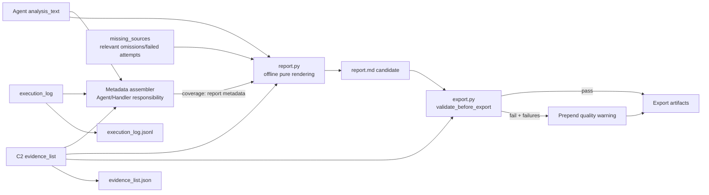

# report-delivery 設計

## Overview

`report-delivery` 負責把 Agent 已完成的分析文字、C2 Evidence Records，以及由「報告實際引用」與 execution log 衍生的 metadata，確定性地渲染為 Markdown 報告，並在匯出前執行品質驗證。模組範圍僅限 `lambda/report.py` 與 `lambda/export.py`；不蒐集資料、不呼叫外部 API、不改寫分析結論，也不改變其他模組契約。

本設計以程式化結構保證下列行為：

- `render_report` 維持既有 C4 `(analysis_text, evidence_list, missing_sources, coverage) -> Markdown` 介面，且對相同輸入永遠產出相同結果。
- 報告 metadata 只描述實際被引用且能解析至 C2 Evidence Record 的證據，以及 execution log 已知的失敗嘗試與題目相關省略。
- 每筆已引用證據以固定規則歸入 13 個 Analysis Dimension 之一；分類不依賴模型自由文字猜測。
- 獨立來源以 canonical provider 去重，同一提供者的別名、URL 或不同 endpoint 只計一次。
- 報告不得輸出固定 `x/5`、固定類別分母、覆蓋百分比、門檻達成率或任何 score。
- `validate_before_export` 的 Source Category `>= 3` 只是一個 pass/fail 匯出條件，不進入報告 metadata。
- 驗證失敗時仍產出交付物，但在 `report.md` 開頭加入品質警示。

### 設計依據與研究摘要

本設計已對照以下專案內權威來源：

- [子 spec 修訂需求](./requirements.md)：定義 Cited Evidence Count、Canonical Independent Source、Known Failed Attempt、Question Relevant Omission 與禁止比率語意。
- [主 spec requirements](../crypto-market-agent/requirements.md)：R12、R13、R15 是需求編號與產品行為的唯一來源。
- [主 spec design](../crypto-market-agent/design.md)：定義 13 維度分類、report metadata 來源、canonical provider 計數及 Property 18/20 的新語意。
- [模組契約](../../steering/contracts.md)：C2 Evidence API、C4 Agent → Report、C5 Handler HTTP Response 不可由本模組改動。

研究結論是：舊 `calculate_coverage(evidence_list) -> (pct, got, missing)` 將「是否蒐集固定五類」誤當成報告品質，無法表達題目導向的 13 維分析、實際引用或失敗嘗試，因此必須完整移除，而不是保留相容包裝。既有 `coverage` 只保留參數名稱作為 C4 相容入口，其內容改為 report metadata；Source Category `>= 3` 則留在 export validator，兩者不得互相推導。

## Architecture



### 邊界與資料流

1. Agent/Handler 從最終分析中的 `evidence_id` 引用與 execution log 整理 report metadata，放入既有 C4 `coverage` 參數；不新增跨模組參數。
2. `report.py` 驗證及保守正規化輸入，只對實際引用且存在於 `evidence_list` 的證據做計數、分類與來源去重。
3. `render_report` 使用固定模板保證「市場判斷／關鍵依據／信心說明」與附錄存在。它不讀環境變數、時鐘、檔案、網路或全域可變狀態。
4. `export.py` 以完整 Evidence Records 驗證 C2 欄位、Source Category、孤兒引用、禁止語句與付費來源限制，回傳單純 `(passed, failures)`。
5. Export Flow 無論驗證通過與否都輸出 `report.md`、`evidence_list.json`、`execution_log.jsonl`；未通過時只在報告開頭插入品質警示，不改 C5 回應欄位或狀態碼。

### 契約保存

- **C2**：Evidence Record 仍為 `source`、`fetched_at`、`content_reference`、`related_claim` 加系統欄位 `evidence_id`。本模組不新增、刪除或覆寫欄位，也不改 Evidence API 行為。
- **C4**：`render_report(analysis_text, evidence_list, missing_sources, coverage)` 的參數數量、順序與 Markdown 回傳型別不變。`coverage` 是歷史名稱，不代表百分比。
- **C5**：成功回應仍含 `run_id`、`report_text`、`evidence_download_url`、`log_download_url`；錯誤回應、HTTP 狀態碼與 CORS 行為不變。Report metadata 不加入 HTTP response。

## Components and Interfaces

### `lambda/report.py`

#### 常數

```python
ANALYSIS_DIMENSIONS = (
    "price",
    "technical_indicators",
    "market_structure_liquidity",
    "derivatives",
    "onchain",
    "sentiment",
    "prediction_markets",
    "news_announcements",
    "macro",
    "defi",
    "development_activity",
    "institutional_data",
    "regulation",
)
```

另以程式常數維護：

- capability prefix／結構化 metric／data type／provider 的分類規則；
- 多規則命中時的固定優先序；
- provider alias → canonical provider 對照表；
- URL hostname → canonical provider 對照表。

這些表必須版本化於程式碼，不得從 `analysis_text`、reason 或 note 動態學習。

#### `classify_dimension(capability_id, source, content_reference) -> str`

為單筆證據選出唯一 primary dimension。分類輸入依以下順序使用：

1. 允許清單中的 `capability_id`；
2. `content_reference` 的結構化 `metric`、`data_type`、`provider`；
3. 正規化後的 source provider；
4. 已知工具的預設維度。

若同一輸入同時命中多個規則，依固定優先序選唯一結果：

`regulation` → `institutional_data` → `development_activity` → `defi` → `prediction_markets` → `derivatives` → `market_structure_liquidity` → `onchain` → `sentiment` → `macro` → `technical_indicators` → `price` → `news_announcements`。

無法可靠分類時不得依 `analysis_text` 臆測。呼叫端應將該項標為 `unclassified` 明細，而不是把 `unclassified` 加入 13 維 Analysis Dimension 或計入實際分析維度。

| Analysis Dimension | 決定性識別規則 | 預設／例子 |
|---|---|---|
| `price` | `price.ohlcv`；spot price、OHLCV、return，排除 order book/derivatives | `get_price_ohlcv` |
| `technical_indicators` | `technical.*`；ATR、Bollinger bandwidth、ADX、volume Z-score、realized volatility、correlation、percentile | `compute_quant` |
| `market_structure_liquidity` | `market_structure.*`；order book、spread、depth、slippage、volume profile、spot liquidity | 一般 OHLCV volume 不命中 |
| `derivatives` | `derivatives.*`；funding、open interest、basis、liquidation、futures/options | 結構化 provider/data type |
| `onchain` | `onchain.*`；block、transaction、address、fee、on-chain flow，排除已命中 DeFi | `get_onchain` |
| `sentiment` | `sentiment.*`；Fear & Greed、結構化社群情緒 | `get_sentiment` |
| `prediction_markets` | `prediction_market.*`；market/contract probability | 已知 prediction provider |
| `news_announcements` | `news.*`；媒體、官方公告、RSS，僅在未命中專門維度時採用 | `search_news` |
| `macro` | `macro.*`；rate、inflation、employment、USD、liquidity、economic calendar | `get_macro` |
| `defi` | `defi.*`；TVL、protocol lending/borrowing、DEX liquidity/volume、yield | protocol metrics |
| `development_activity` | `development.*`；commit、contributor、release、issue、repository activity | GitHub release 即使由 news 工具取得仍歸此類 |
| `institutional_data` | `institutional.*`；ETF flow/holding、fund/custody/institutional position/research | 已知機構 provider |
| `regulation` | `regulation.*`；regulator rule/enforcement/filing、court、legislation | 官方監管 provider |

#### `canonicalize_provider(source, content_reference) -> str | None`

canonical provider 計數規則：

1. 若結構化 `content_reference.provider` 命中 alias table，回傳其 canonical 名稱。
2. 若 source 是 URL，解析 hostname、轉小寫、移除尾端 `.` 與 `www.`；忽略 scheme、port、path、query、fragment，再套用 hostname alias table。
3. 同一 provider 的已知多網域、產品名、API 名與文字別名映射到同一 canonical 名稱，例如 API endpoint 與官網不得重複計數。
4. 非 URL source 先 trim、Unicode/大小寫正規化，再套用文字 alias table。
5. 未知但合法的 URL 使用正規化 hostname；未知非 URL 使用正規化名稱。空值或不可解析值回傳 `None`，不得虛構 provider。

因此，同一提供者的不同 endpoint、query 或別名只計一次；不同 provider 即使屬於同一 Source Category 仍分別計數。

#### `build_analysis_summary(evidence_list, coverage) -> dict`

此函式是純資料轉換，輸出附錄所需 metadata：

- 取得 `coverage.analyzed_evidence_ids`；此欄位應由最終 `analysis_text` 的引用產生。
- 若該欄位缺失，`render_report` 先從 `analysis_text` 解析可辨識的 `evidence_id`，建立僅含這些引用的 normalized metadata，再呼叫 `build_analysis_summary`；若無法解析則採空引用集合。不得把所有已蒐集證據當成已分析證據。
- 與 `evidence_list` 的合法且唯一 `evidence_id` 取交集，得到 cited evidence。不存在的 ID 留給 export 驗證為 orphan，不計入任何報告數量。
- `cited_evidence_count` 是 cited evidence 的唯一 ID 數。
- `canonical_independent_source_count` 是 cited evidence 的 canonical provider 非空集合大小。
- 每筆 cited evidence 經 `classify_dimension` 得到唯一 primary dimension；逐維度列出 `evidence_id`、canonical provider 與 `content_reference` 摘要。
- 從 `coverage.attempted_capabilities` 只保留 `error`、`unavailable`、`timeout`，輸出可確定的 dimension、tool/capability、status、reason。無法確定 dimension 時保留原始工具或 capability，不臆測維度。
- 從 `coverage.relevant_omissions` 只保留明確標為題目相關的項目。已知失敗嘗試可同時成為相關缺失，但顯示時以穩定 key 去重。
- 不遍歷 13 維清單來推導「未使用 = 缺失」。無關且未嘗試的維度不出現在缺失列表。

#### `build_evidence_table(evidence_list) -> str`

輸出完整 Markdown 證據表，欄位包含 `evidence_id`、`source`、`fetched_at`、`content_reference`、`related_claim`。它不修改 Evidence Records，也不負責決定 cited evidence count。

#### `render_report(analysis_text, evidence_list, missing_sources, coverage) -> str`

- 保留 C4 介面。
- 使用固定 Markdown 模板輸出「市場判斷」、「關鍵依據」、「信心說明」與附錄。
- 附錄列出實際 Analysis Dimension、Cited Evidence Count、Canonical Independent Source Count、逐維 evidence/provider 明細、Known Failed Attempts、Question Relevant Omissions 與完整證據表。
- `coverage` 解讀為 report metadata；`missing_sources` 僅作為 Question Relevant Omission／Known Failed Attempt 的相容輸入，必須經相關性與狀態規則過濾。
- 不產生 `x/5`、`x/3`、任何固定分母、ratio、percentage、coverage rate 或 dimension/source score。
- 不呼叫網路、檔案、S3、時鐘、隨機數、環境變數或模型；不依賴輸入容器的物件位址或未排序集合，因此同輸入 byte-for-byte 相同。

`calculate_coverage` 從設計與實作介面中移除，不提供 fixed-five 相容函式。

### `lambda/export.py`

#### `export_evidence_list(evidence_list, fmt="json") -> str`

以 JSON 為主要格式、CSV 為選用格式匯出 C2 Evidence Records；不加入 report metadata 欄位。

#### `export_execution_log(log) -> str`

依輸入順序輸出 JSONL，每個非空行皆為可獨立解析的 JSON object。

#### `classify_source_category(evidence_record) -> str | None`

以既有、程式維護的 export-policy 規則，從 Evidence Record 的結構化 `content_reference` 與 canonical provider 判定一個 Source Category。此分類只服務 `validate_before_export`，不得讀取 Report 的 Analysis Dimension 數量，也不得把 canonical provider 數當成 category 數。未知或無法證明的 category 回傳 `None`；不為了達門檻而猜測。validator 只對觀察到的非空 category 集合去重並比較 `>= 3`，不建立「總共有幾類」的固定分母。

#### `validate_before_export(report_text, evidence_list) -> (bool, list[str])`

執行以下獨立 pass/fail 檢查：

1. 報告不含禁止投資建議語句（中英文清單）。
2. 完整 Evidence Records 涵蓋的唯一 Source Category 數量 `>= 3`。
3. 每筆 Evidence Record 的 C2 欄位完整。
4. 報告引用的每個 `evidence_id` 都存在於 `evidence_list`。
5. 付費來源不是唯一關鍵依據。

回傳值只含總體 boolean 與失敗原因清單。Source Category 驗證不得回傳 `n/3`、百分比、score 或供 `render_report` 使用的 coverage metadata；Source Category 與 Canonical Independent Source 是兩個不同維度：前者是 export policy 類型，後者是報告所引用 provider 的去重數。

#### Export Flow

若 validator 未通過，仍匯出三項交付物，並在最終報告開頭加入：

```markdown
> ⚠ 品質警示：
> - {failure 1}
> - {failure 2}
```

警示只列 pass/fail 原因，不把類別數轉成比例、百分比或分數。此降級行為不改 C5 HTTP status、body 或 CORS。

## Data Models

### C2 Evidence Record（唯讀輸入）

```json
{
  "evidence_id": "ev_a1b2c3",
  "source": "https://api.binance.com/api/v3/klines?symbol=SOLUSDT",
  "fetched_at": "2026-07-30T14:15:30Z",
  "content_reference": {
    "pair": "SOLUSDT",
    "data_type": "ohlcv",
    "range": "2026-06-01/2026-07-30"
  },
  "related_claim": "檢驗近期價格波動是否擴大"
}
```

### Report Metadata（C4 `coverage` 相容參數）

```json
{
  "analyzed_evidence_ids": ["ev_a1b2c3", "ev_d4e5f6"],
  "evidence_capabilities": {
    "ev_a1b2c3": "price.ohlcv",
    "ev_d4e5f6": "technical.compute_quant"
  },
  "attempted_capabilities": [
    {
      "capability_id": "derivatives.funding",
      "tool_name": "search_news",
      "status": "timeout",
      "reason": "upstream timeout"
    }
  ],
  "relevant_omissions": [
    {
      "dimension": "institutional_data",
      "reason": "本次無可用來源",
      "confidence_impact": "無法交叉驗證機構資金流",
      "question_relevant": true
    }
  ]
}
```

約束：

- `analyzed_evidence_ids` 必須源自最終報告引用；陣列順序不影響計數，輸出採固定排序。
- `evidence_capabilities` 只能使用程式允許的 capability 常數；自由文字 reason/note 不得覆寫分類。
- `attempted_capabilities` 源自 execution log 與 dispatch 時已知 metadata；只有明確失敗狀態成為 Known Failed Attempt。
- `relevant_omissions` 由 Agent/Handler 判斷題目相關性；渲染器不自行把 13 維未命中項目補成 omission。
- 此 model 不加入 Evidence Record 或 C5 HTTP Response。

### Analysis Summary（內部衍生模型）

```json
{
  "analysis_dimensions": ["price", "technical_indicators"],
  "cited_evidence_count": 2,
  "canonical_independent_source_count": 1,
  "dimension_details": {
    "price": [
      {
        "evidence_id": "ev_a1b2c3",
        "canonical_provider": "binance",
        "content_reference": "SOLUSDT OHLCV, 2026-06-01/2026-07-30"
      }
    ]
  },
  "known_failed_attempts": [
    {
      "dimension": "derivatives",
      "capability_id": "derivatives.funding",
      "status": "timeout",
      "reason": "upstream timeout"
    }
  ],
  "relevant_omissions": [
    {
      "dimension": "institutional_data",
      "reason": "本次無可用來源",
      "confidence_impact": "無法交叉驗證機構資金流"
    }
  ]
}
```

此模型刻意不含 `coverage_percentage`、`coverage_ratio`、`dimension_score`、固定 denominator 或 Source Category threshold progress。

### Validation Result

```python
(passed, failures) = (False, [
    "報告含禁止投資建議語句",
    "證據來源類別未達匯出門檻",
])
```

`failures` 是可顯示的離散原因，不含達成率或評分。

## Correctness Properties

*A property is a characteristic or behavior that should hold true across all valid executions of a system-essentially, a formal statement about what the system should do. Properties serve as the bridge between human-readable specifications and machine-verifiable correctness guarantees.*

### Property Reflection

依 acceptance-criteria prework，先合併與消除重複屬性：

- 「實際維度」、「引用證據數」、「canonical provider 數」與「逐維明細」都由同一 cited-evidence 集合衍生，合併為單一摘要忠實性屬性，避免各自測試卻漏掉彼此一致性。
- Known Failed Attempt 與 Question Relevant Omission 都是 execution-derived 缺口資訊；合併為一個精確過濾屬性，同時驗證無關且未嘗試維度不會被補列。
- `coverage` 的新語意與禁止 fixed-five/percentage/score 是同一輸出不變量；不再保留任何舊 P18「覆蓋率計算」屬性。
- Source Category `< 3` 不通過、`>= 3` 通過，以及門檻不得洩漏至 Report，合併成一個 iff 邊界與隔離屬性。
- C4 四參數介面、三章節與 Markdown 格式可由一個模板契約屬性涵蓋；離線純函式與決定性仍保留獨立屬性，因其可發現全域狀態、時間與 I/O 依賴等不同缺陷。
- C2/C5 契約保存、品質警示後仍匯出、S3 路徑與 presigned URL 屬 smoke/integration concerns，不建立不自然的 PBT 屬性。
- 事實→推論→結論、一致/背離/不足與矛盾取捨屬 Agent 產生內容的語意品質，以代表性 example/integration tests 驗證。

反思後，每個下列屬性提供獨立驗證價值。

### Property 1: C4 模板契約與 Markdown 結構

*For any* 合法的 `analysis_text`、`evidence_list`、`missing_sources` 與 report metadata，使用既有四參數 C4 介面呼叫 `render_report` 必定回傳 Markdown 字串，且包含「市場判斷」、「關鍵依據」、「信心說明」三個章節。

**Validates: Requirements 1.1; Main R12.1, R12.8**

### Property 2: 離線純函式與決定性

*For any* 合法的 C4 輸入，`render_report` 在完全離線環境重複執行必定產生 byte-for-byte 相同輸出，且不執行網路、檔案、S3、時鐘、隨機數、環境變數或模型存取。

**Validates: Requirements 1.2**

### Property 3: 13 維分類的決定性、封閉性與唯一性

*For all* 已允許的 capability、合法結構化 `content_reference` 與 source 組合，`classify_dimension` 對相同輸入必定回傳相同結果；可分類結果必定是 13 個 `ANALYSIS_DIMENSIONS` 之一，且多規則命中時依固定優先序選出唯一 primary dimension。

**Validates: Requirements 1.3, 1.6, 1.10; Main R12.5**

### Property 4: 引用衍生摘要忠實性

*For any* 合法 Evidence Records 與 report metadata，分析摘要必定只使用「實際引用 ID 與合法唯一 Evidence ID 的交集」，使：(a) `cited_evidence_count` 等於該交集大小；(b) 實際 Analysis Dimension 恰等於該交集中可分類證據的 primary dimension 集合；(c) 每筆可分類 cited evidence 恰出現在一個維度明細中並保留正確 evidence ID；(d) 未引用證據與孤兒引用不計入摘要。

**Validates: Requirements 1.3, 1.4, 1.6, 1.10; Main R12.5**

### Property 5: Canonical provider 去重

*For any* cited Evidence Records，同一資料提供者的 URL endpoints、query variants、hostname aliases 與文字別名在 canonicalization 後必定只計為一個來源；不同 canonical providers 必定分別計數，且 `canonical_independent_source_count` 等於逐維明細中非空 canonical provider 的唯一集合大小。

**Validates: Requirements 1.5, 1.6; Main R12.5**

### Property 6: 已知失敗與相關省略精確過濾

*For any* success/error/unavailable/timeout 混合的 attempted capabilities、題目相關與無關 omissions，以及 `missing_sources` 相容輸入，Report 必定完整列出可證明的 Known Failed Attempts 及其狀態，並只列明確題目相關或已嘗試失敗的缺失；無關且未嘗試的維度必定不出現。

**Validates: Requirements 1.7, 1.8, 1.11; Main R12.6, R13.5, R13.6**

### Property 7: 報告品質 metadata 無比率、百分比或分數

*For any* 證據數、canonical provider 數、Analysis Dimension 組合與 Source Category 組合，`build_analysis_summary` 與 `render_report` 程式產生的品質 metadata 必定不包含固定 `x/5`、`x/3`、固定類別分母、coverage ratio、coverage percentage、門檻達成率、dimension score 或 source score。

此屬性只禁止把報告品質與類別覆蓋表示為比率／百分比／分數；`analysis_text` 中屬於市場事實的價格變動百分比或技術指標百分位不在禁止範圍，渲染器仍須原樣保留。

**Validates: Requirements 1.9, 1.10, 1.13; Main R12.7, R13.9**

### Property 8: 三來源類別門檻只約束匯出

*For any* Evidence Record 清單，Source Category 這一項 export validation 若且唯若唯一類別數 `>= 3` 時通過；同一輸入的 Report 不得顯示門檻分母、達成率、coverage percentage 或 score，且 canonical provider count 不得被當成 Source Category count。

**Validates: Requirements 1.12, 1.13; Main R13.8, R13.9**

### Property 9: 孤兒 evidence 引用必定拒絕

*For any* Report 引用集合與 Evidence Record ID 集合，只要存在至少一個引用 ID 不屬於 Evidence Record ID 集合，`validate_before_export` 必定回傳未通過並列出孤兒引用原因；所有引用皆存在時，此檢查項目必定通過。

**Validates: Requirements 1.14; Main R12.3**

### Property 10: 禁止投資建議語句必定拒絕

*For any* 禁止投資建議語句與任意前後文組合，`validate_before_export` 必定回傳未通過並列出禁語原因。

**Validates: Main R13.1, R13.7**

### Property 11: Execution Log 匯出可逐行解析

*For any* 合法 execution log 記錄序列，`export_execution_log` 的每個非空輸出行必定可由 `json.loads` 解析成一筆 JSON object，且解析後順序與輸入一致。

**Validates: Main R15.1**

## Error Handling

### 設計原則

報告渲染採「保守降級、不得杜撰」：輸入不完整時仍維持 C4 Markdown 結構，但只顯示能由 Evidence Records、引用與 execution-derived metadata 證明的內容。匯出驗證採「標記失敗、仍完成交付」：品質問題不得讓三項交付物消失。

| 情況 | `report.py` 行為 | `export.py`／Export Flow 行為 |
|---|---|---|
| `coverage` 為 `None` 或缺欄位 | 產生空摘要；若有可解析的引用 metadata 才保守採用，不回復 fixed-five 推算 | 不受影響 |
| `analyzed_evidence_ids` 重複 | 穩定去重後計數 | 引用存在性照唯一 ID 檢查 |
| 引用 ID 不存在 | 不計入維度、證據或 provider 數，不虛構明細 | orphan validation 失敗並列出 ID |
| Evidence ID 重複 | 使用固定、文件化的 first-record-wins 規則建立 lookup，並避免重複計數 | C2 完整性/ID 衝突列為 validation failure |
| source 空白或無法解析 | canonical provider 為 `None`，不計來源 | C2 欄位完整性失敗 |
| capability 無法分類 | 不塞入任一 13 維；在可追溯明細保留 `unclassified` 原始 capability/tool | 不影響 Source Category policy 的獨立判定 |
| attempt status 為 success | 不列為 Known Failed Attempt | 不受影響 |
| attempt status 為 error/unavailable/timeout | 保留狀態與 reason；可分類才標 dimension，否則保留原始 capability/tool | 不受影響 |
| omission 未明確題目相關且未嘗試 | 丟棄，不顯示 | 不受影響 |
| report metadata 含舊 percentage/pct 欄位 | 忽略舊欄位，不渲染、不轉譯 | 不把它當 Source Category validation input |
| validation 任一項失敗 | 報告內容本身不被偷偷改寫 | 回傳 failure list；Export Flow 在頂部加品質警示後仍寫出所有 artifacts |
| evidence/log serialization 失敗 | 不適用 | 以明確 failure 傳給既有 handler error path；不得改 C5 body/status/CORS 契約 |

為維持決定性，所有集合輸出使用固定排序；錯誤文字來自固定模板，不包含當下時鐘或非決定性物件表示。

## Testing Strategy

### PBT 適用性

本功能適合 Property-Based Testing，因為維度分類、引用集合交集、canonical provider 正規化、metadata 分組、缺失過濾、字串驗證與 JSONL serialization 都是低成本、明確 input/output 的純邏輯。Export Flow 的儲存、C5 Handler、S3 與 Agent 語意行為不適合 PBT，改用 unit/example/integration tests。

### 測試層級

| 層級 | 範圍 | 工具 | 要求 |
|---|---|---|---|
| Property tests | Properties 1-11 的純邏輯 | Hypothesis + pytest | 每個 property 單一測試，至少 100 iterations |
| Unit/example tests | 特定格式、禁語、警示、錯誤降級、語意代表案例 | pytest | 聚焦邊界與可讀失敗訊息 |
| Integration tests | Export Flow、C2/C4/C5、C3 storage wiring | pytest + mocks/moto | 驗證契約與呼叫順序，不呼叫真實外部 API |

每個 property test 必須加註：

```python
# Feature: report-delivery, Property {number}: {property_text}
```

不得自行實作隨機測試框架；統一使用 Hypothesis。

### Property generators 重點

- **13 維分類**：每一個允許 capability prefix 至少被生成；加入同時命中多規則的 source/content_reference，驗證固定優先序。
- **引用集合**：生成重複 ID、未引用 Evidence Records、孤兒引用、空集合、不同輸入順序與 13 維混合。
- **provider canonicalization**：同 provider 不同 scheme/subdomain/path/query/文字別名、已知多網域、未知合法 hostname、空 source 與不同 providers。
- **attempts/omissions**：混合 success/error/unavailable/timeout、可分類/不可分類 capability、相關/無關與重複項目。
- **no-ratio invariant**：生成 0、3、5、13 等容易誤觸舊分母的維度/類別/來源數；檢查程式產生的品質 metadata，不誤判 analysis_text 內合法市場百分比。
- **Source Category threshold**：類別數與 canonical provider 數必須獨立生成，例如三個 providers 同一 category、同一 provider 多 category 標記，避免兩個概念耦合。
- **禁語**：中英文禁語、大小寫、標點與任意 Unicode 前後文。

### Unit / Example tests

1. `render_report` 固定輸出三章節、附錄與完整 C2 證據表。
2. 封鎖 network/file/S3/time/random clients 後仍可渲染，並對重排後等價 metadata 產生規則定義的穩定輸出。
3. 逐一覆蓋 13 維分類表與多規則優先序；新聞工具取得 GitHub release 時仍歸 `development_activity`。
4. 同一 provider 的多 endpoint/別名只計一次；不同 provider 即使同 Source Category 仍分別計數。
5. 附錄只含 cited evidence 衍生的維度、Cited Evidence Count、Canonical Independent Source Count 與逐維明細；僅蒐集未引用的證據不出現於摘要。
6. error/unavailable/timeout 顯示 status/reason；success 不顯示；不可分類失敗保留原始 tool/capability 而不臆測維度。
7. 相關 omission 顯示 dimension、reason、confidence impact；無關且未嘗試維度不出現。
8. 以 `5` 筆證據、`5` 維、`3` 類別等案例驗證沒有 `5/5`、`x/3`、coverage percentage 或 score；同時確認市場報酬百分比與 quant 百分位仍原樣保留。
9. Source Category `< 3` 與 `>= 3` 邊界各一例，只檢查 pass/fail failure item，不檢查或輸出達成率。
10. orphan evidence ID、C2 缺欄位、付費來源唯一依據及中英文禁語各有清楚 failure item。
11. validation failure 品質警示列出離散原因，不含類別比例或分數。
12. 一致訊號、背離訊號、證據不足、來源矛盾各一個 Agent 輸出代表案例，驗證 render 保留事實→推論→結論與 evidence ID；不讓 renderer 自行生成語意。

### Integration / Contract tests

- **C2**：Evidence Record 經 table/JSON export 後固定欄位與值不變，輸入物件未被 mutation。
- **C4**：Agent/Handler 仍以四參數順序呼叫 `render_report`；`coverage` 傳 report metadata 而非 number/percentage；無 `calculate_coverage` 呼叫。
- **C5**：成功/失敗 response body、status code 與 CORS 維持原契約，report metadata 不加入 HTTP response。
- **Export Flow**：spy 驗證 `validate_before_export` 在 `report.md` 儲存前執行；通過與未通過都輸出 `report.md`、`evidence_list.json`、`execution_log.jsonl`。
- **Validation degradation**：未通過時 report 開頭有品質警示且其餘報告不遺失；三項 artifacts 仍寫入 `runs/{run_id}/`。
- **Source Category isolation**：同一次執行的 validator 以 `>= 3` 決定該檢查 pass/fail，而 report 只顯示 cited providers 與 dimensions。
- **Storage wiring**：使用 mocks/moto 驗證 evidence/log presigned URLs 與 run-scoped filenames；不在本模組測真實 S3 服務行為。

### 舊測試遷移

- 刪除／改寫以 `calculate_coverage`、固定五類、`P18 覆蓋率計算`、`4/5`、`80%` 或 dimension score 為 expected result 的測試。
- 原 P16 三章節測試保留意圖，改對應本設計 Property 1。
- 原 P17 禁語偵測保留意圖，改對應 Property 10。
- 原 P18 改為 Properties 3-8：13 維決定性分類、引用衍生摘要、canonical provider 去重、失敗/相關省略過濾、no-ratio/no-percentage/no-score invariant，以及 export threshold isolation。
- JSONL 可解析與孤兒引用測試保留，分別對應 Properties 11、9。

不需要啟動 development server 或 watcher；測試只使用一次性 `pytest`/Hypothesis 執行。

## Pipeline Presentation 設計增補

### 單一中介模型

Report 先把 analysis/evidence/execution metadata 正規化成內部 `ReportModel`，再由同一模型分別產生 Markdown 與 C7，禁止兩條渲染路徑各自解析 LLM 文字：

```text
analysis + evidence + execution + series
              │
       build_report_model()
          ├── render_report_model_md()
          └── build_report_data()
                    │
             validate_c7()
```

`ReportModel` 包含 question_type、symbols、verdict、dimensions、signals、checked_normal、題型專屬資料、series、prefetch outcome 與 watchlist。Evidence 先按 ID 建索引，任何孤兒引用在 C7 驗證時失敗。

### C7 builders

- `_build_verdict`：正規化 stance/confidence/label/invalidation；confidence 必須為可追溯的 0–1 數值，缺少可信值時 C7 validation 失敗並走 Markdown fallback，不得猜測或以固定預設值代替。
- `_build_dimensions`：保留 `state=na` 與缺失原因；comparison 建立 per_symbol。
- `_build_signals`：只接受有 Evidence 支撐的 red/yellow 訊號；正常檢查放 checked_normal。
- `_build_question_block`：hypothesis 與 comparison 互斥，其他題型設 null。
- `_normalize_series`：日期升冪、去重、有限數值、裁切近 90 日；不在 Report 重算市場指標。
- `_build_coverage`：由題目相關 prefetch outcome 計算，分母為 got+missing；空集合回 null。

### Markdown 模板

共同區塊為結論、信心/推翻條件、維度狀態、異常與正常檢查；single 再展開維度與 watchlist，hypothesis 加證據天平，comparison 加並排表與條件框。所有模板維持既有三章節與禁投資建議品質門。

### 降級與輸出

`build_report_data` 外層捕捉 schema/normalization error，記錄 `build_report_data:error` 後回傳 None。Export 先保存既有三項交付物；C7 成功才以 storage 原子 API 保存 `report_data.json`。Handler 直接重用已保存前的同一 dict。Frontend 收到 null 時只渲染 report_text。

### 測試

- 每一必要欄位、enum、evidence 外鍵、日期排序與 90 日裁切。
- 三題型 golden fixtures，以及 C7/Markdown verdict、信心與訊號一致性 property test。
- coverage 0/59/60/100/null 邊界且不等同固定類別分數。
- builder/validator/storage 任一失敗時原有三項交付物仍存在。
